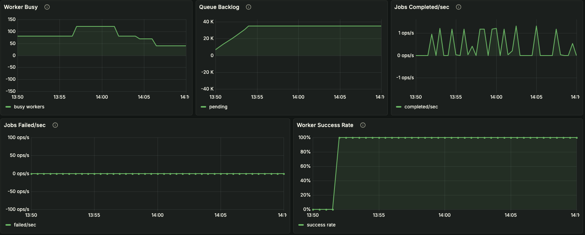
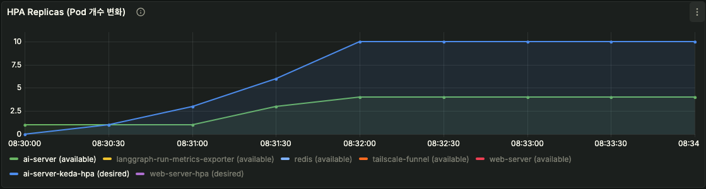
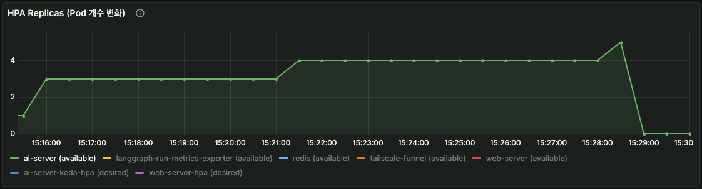
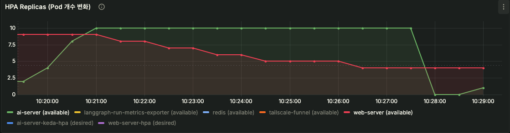
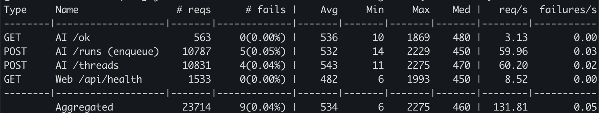
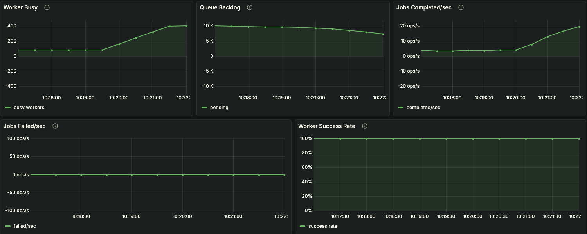

# DeepQuest: Backlog-driven Autoscaling Optimization

DeepQuest는 이력서 기반의 AI 기술면접 코칭 서비스입니다.
Web API → Queue → AI Worker 구조로 동작합니다.
요청은 Redis 기반 큐에 적재되고, worker가 비동기로 처리합니다.
대규모 요청 환경에서도 backlog, autoscaling, worker 처리량을 함께 최적화했습니다.

> backlog 기반 autoscaling이 실제 처리량 증가로 이어지도록 병목을 제거했습니다.

## 내 역할

DeepQuest에서 저는 AI 처리 파이프라인의 성능 최적화와 운영 안정화 흐름을 주도했습니다.
단순히 배포 자동화 작업이 아니라, `Web API -> Queue -> AI Worker` 구조에서 어디가 실제 병목인지 관측 지표를 만들고, 병목 원인을 추적하여 트래픽 환경에서도 안정적으로 운영할 수 있게 하는 역할을 맡았습니다.
이를 위해 queue backlog, worker busy, 완료 처리량, DB 연결 상태를 함께 확인할 수 있도록 실험 환경과 관측 기준을 정리했습니다.

## 시스템 진화 흐름

DeepQuest는 초기에는 단순한 API 기반 구조였지만, 안정적인 운영과 트래픽 대응을 위해 여러 단계를 거쳐 구조를 확장했습니다.

먼저 지속적인 배포와 운영을 위해 CI/CD 파이프라인을 구축하고, 베어메탈 기반 Kubernetes 클러스터를 직접 구성해 서비스가 실제로 배포·운영될 수 있는 환경을 만들었습니다.
이후 AI 처리 특성상 요청 대비 처리 시간이 긴 문제를 해결하기 위해 Web API → Queue → Worker 구조로 분리하고, 주요 처리 경로를 비동기화하여 기본적인 처리 안정성을 확보했습니다.

그 다음 단계에서는 worker 수를 늘려도 처리량이 선형적으로 증가하지 않고 queue backlog가 누적되는 문제가 발생했고, 이를 해결하기 위해 rate limiting과 worker 제한(concurrent_max)을 통해 시스템 보호 구조를 먼저 구축했습니다.

이 과정을 거친 뒤, 실제 트래픽 환경에서 backlog를 기준으로 자동 확장하는 것이 필요하다고 판단하여 KEDA 기반 autoscaling을 적용했습니다.
이후에는 단순히 scale-out을 적용하는 것에서 끝나지 않고, scheduler, DB connection, runtime 구조까지 병목을 함께 조정하며 scale-out이 실제 처리량 증가로 이어지는 구조를 만드는 데 집중했습니다.

관련 문서:
- [시스템 개발 과정 일부](docs/status/status-2026-02-08-2026-03-28-app-flow.md)

## 핵심 결과

- 처리량(Throughput) 극대화: Jobs Completed/sec 지표 기준 4 -> 20 ops/s (500% 향상)

- 스케일아웃 병목 해소: K8s Pod Available 4 -> 10, Worker Busy 160 -> 400으로 가용성 확보

- 트래픽 방어 및 백로그 해소: 100 VU (약 130 req/s) 지속 부하 환경에서 실패율 0.04% 달성 및 Queue Backlog 감소세 전환

- 외부 API 쿼터 보호: Redis 전역 Rate Limiter를 도입하여 Gemini API 호출량을 60~70 RPS 내외로 안전하게 제어

관련 문서:
- [최종 결과 요약](evidence/keda/2단계_retry_2/summary.md)
---

| Metric | Before | After |
|--------|--------|-------|
| Available Pods | ~4 | ~10 |
| Worker Busy | ~160 | ~400 |
| Completed/sec | ~4 | ~20 |
| Queue Backlog | 증가 | 감소 |
| Success Rate | 100% | 100% |

---

## 1. 문제 정의

DeepQuest는 Web 계층은 높은 요청량을 받을 수 있었지만, 실제 AI 처리 계층은 비동기 run backlog가 빠르게 쌓이며 처리 완료율이 낮았습니다.

주요 문제는 다음과 같았습니다.

- worker는 포화되는데 실제 완료 처리량은 낮았습니다.
- CPU/Memory만으로는 실제 병목이 잘 보이지 않았습니다.
- CPU 기반 HPA는 backlog 증가에 적절히 반응하지 못했습니다.
- 외부 Gemini API는 별도 rate limit 보호가 필요했습니다.

---

## 2. 시스템 구조

> DeepQuest의 요청 흐름과 관측 지점을 함께 보여주는 전체 아키텍처 다이어그램입니다.

- Web API: 요청을 접수했습니다.
- LangGraph Runtime: run 생성 및 상태 관리를 담당했습니다.
- Redis: 전역 rate limiting과 보조 상태 저장에 사용했습니다.
- Postgres: run, thread, checkpoint 저장에 사용했습니다.
- AI Worker: 실제 Gemini 호출을 수행했습니다.
- Prometheus + Grafana: backlog, worker, latency, HPA를 모니터링했습니다.
- KEDA: backlog 기반 autoscaling을 수행했습니다.

---

## 3. 1차 실험: concurrent_max=40 검증

### 설정

- `concurrent_max=40`
- queue metrics exporter + Grafana 대시보드 적용
- Locust로 AI enqueue 부하 생성

### 결과

- `Worker Busy`가 설정값 근처에서 포화됐습니다.
- `Queue Backlog`가 빠르게 증가했습니다.
- `Jobs Failed/sec`는 거의 `0`이었습니다.
- 초과 요청은 즉시 실패보다 backlog 적체 형태로 보호됐습니다.

> worker 동시 처리 상한에 도달한 뒤 backlog가 빠르게 쌓이는 1차 실험 결과입니다.

참고 증거:
- [concurrent_max=40 정리](evidence/concurrent_max=40/README.md)
- [핵심 로그](evidence/concurrent_max=40/ai-load-test-important-logs.txt)

---

## 4. KEDA 적용

### 설정

- `ScaledObject`
- metric: `sum(ai_job_queue_pending)`
- threshold: `40`
- `minReplicaCount=1`
- `maxReplicaCount=10`

### 초기 결과

- `desired replica=10`까지 상승했습니다.
- 하지만 실제 `available replica`는 `4` 수준에서 멈췄습니다.
- autoscaler는 동작했지만, 실제 가용 파드 증가는 제한됐습니다.

> KEDA가 desired replica는 올렸지만 실제 available replica 증가는 제한된 초기 상태입니다.

관련 문서:
- [1단계 Retry 로그](evidence/keda/1단계_retry/step1-low-load-retry-logs.txt)
- [Autoscaling And Throughput Issues](infra/docs/troubleshooting/autoscaling-and-throughput.md)

---

## 5. 병목 분석

### 5.1 스케줄링 병목

- `ai-server cpu request = 1`
- Kubernetes scheduler는 실제 CPU 사용량이 아닌 request 값을 기준으로 pod를 배치하기 때문에
- cpu request=1 설정으로 인해 클러스터에 여유 리소스가 있어도 추가 pod가 스케줄되지 못했습니다.

> CPU 사용량이 낮아 보여도 request 설정 때문에 실제 pod 확장이 막히는 구간을 보여주는 그래프입니다.

### 5.2 DB connection 병목

- 기본 `max_connections = 100`
- 부하 시 실제로 `too many clients already`가 발생했습니다.
- LangGraph runtime, exporter, worker가 모두 같은 Postgres를 직접 사용했습니다.

### 5.3 애플리케이션 처리 병목

- `resume_parser`의 동기 PDF 다운로드
- `.invoke()` 기반 동기 LLM 호출
- 동기 stream 루프
- worker가 외부 응답 대기 동안 오래 점유되는 구조

---

## 6. 개선 작업

### 6.1 관측

- `langgraph.run` 기반 queue metrics exporter를 추가했습니다.
- Grafana에서 다음 지표를 볼 수 있게 구성했습니다.
  - `Worker Busy`
  - `Queue Backlog`
  - `Jobs Completed/sec`
  - `Jobs Failed/sec`
  - `Worker Success Rate`

### 6.2 외부 API 보호

- Redis 기반 전역 rate limiter를 적용했습니다.
- Gemini 호출량을 약 `60 RPS` 수준으로 제한했습니다.

### 6.3 인프라/설정 개선

- `Postgres max_connections`: `100 -> 200 -> 500`
- Postgres memory limit를 상향했습니다.
- `ai-server cpu request`: `1 -> 200m`

### 6.4 애플리케이션 개선

- `resume_parser` 다운로드 경로를 async로 전환했습니다.
- `question_feedback_gen`, `question_gen`, `jd_structuring`을 async로 전환했습니다.
- `jd_to_text` native stream / langchain stream 경로를 async로 정리했습니다.

관련 문서:
- [실험진행문서](infra/docs/tasks/task-2026-03-24.md)

---

## 7. 개선 후 재실험 결과

가장 의미 있는 결과는 `4차 실험 결과`에서 나왔습니다.

### 주요 수치

- `ai-server available`: `4 -> 10`
- `Worker Busy`: `160 -> 400`
- `Jobs Completed/sec`: `4 -> 20`
- `Queue Backlog`: 증가 -> 감소
- `Worker Success Rate`: `100% 유지`
- `Jobs Failed/sec`: 거의 `0`

### Locust 기준

- `100 virtual users`
- aggregate 약 `131.81 req/s`
- 실패율 약 `0.04%`
- endpoint별 req/s 약 `60` 수준 유지

### 결과

- `ai-server`가 실제로 `10개`까지 scale-out됐습니다.
- worker 수가 `400` 수준까지 증가했습니다.
- `Jobs Completed/sec`가 약 `20 ops/s` 수준까지 상승했습니다.
- queue backlog가 누적이 아니라 감소로 전환됐습니다.

-> scale-out이 실제 처리량 증가로 연결됐습니다.

> 튜닝 이후 KEDA scale-out이 실제 available pod 증가로 이어진 최종 HPA 상태입니다.

> 이 이미지는 꼭 봐야 하는 핵심 지표입니다. 100 VU 기준 약 `130 req/s` 처리와 `0.04%`의 낮은 실패율을 함께 확인할 수 있습니다.

> AI 요청도 `enqueue`와 `thread` 경로가 각각 약 `60 req/s` 수준으로 분산되어, 특정 endpoint에 치우치지 않고 균형 있게 처리되는 흐름을 보여줍니다.

> 최종적으로 높은 요청률과 낮은 실패율을 함께 확인한 Locust 결과 화면입니다.

참고 증거:
- [최종 결과 요약](evidence/keda/2단계_retry_2/summary.md)

---

## 8. 배운 점

- CPU 사용률이 낮다고 해서 스케줄링 문제가 없는 것은 아니었습니다.
- Kubernetes에서는 실사용량보다 `request`가 더 중요한 병목이 될 수 있었습니다.
- backlog 기반 autoscaling은 observability가 먼저 갖춰져야 의미가 있었습니다.
- KEDA는 잘 동작해도, 실제 처리량은 애플리케이션 구조와 DB 상태에 크게 좌우됐습니다.
- rate limiter, autoscaling, async 리팩터링은 따로가 아니라 함께 설계해야 했습니다.

---

## 9. 한 줄 결론

100 virtual users 기준 약 `130 req/s`의 지속 부하 환경에서, backlog 기반 KEDA, Redis 전역 rate limiting, Postgres connection 상향, `ai-server` CPU request 조정, 주요 AI 경로 async 전환을 통해 처리율을 약 `20 ops/s`까지 끌어올리고 queue backlog를 실제로 감소시키는 단계까지 검증했습니다.
