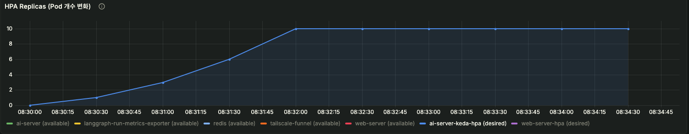
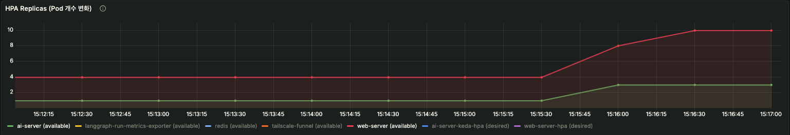
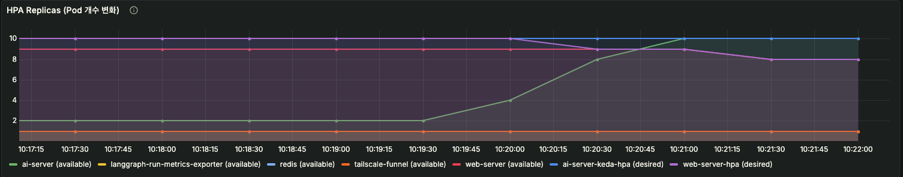
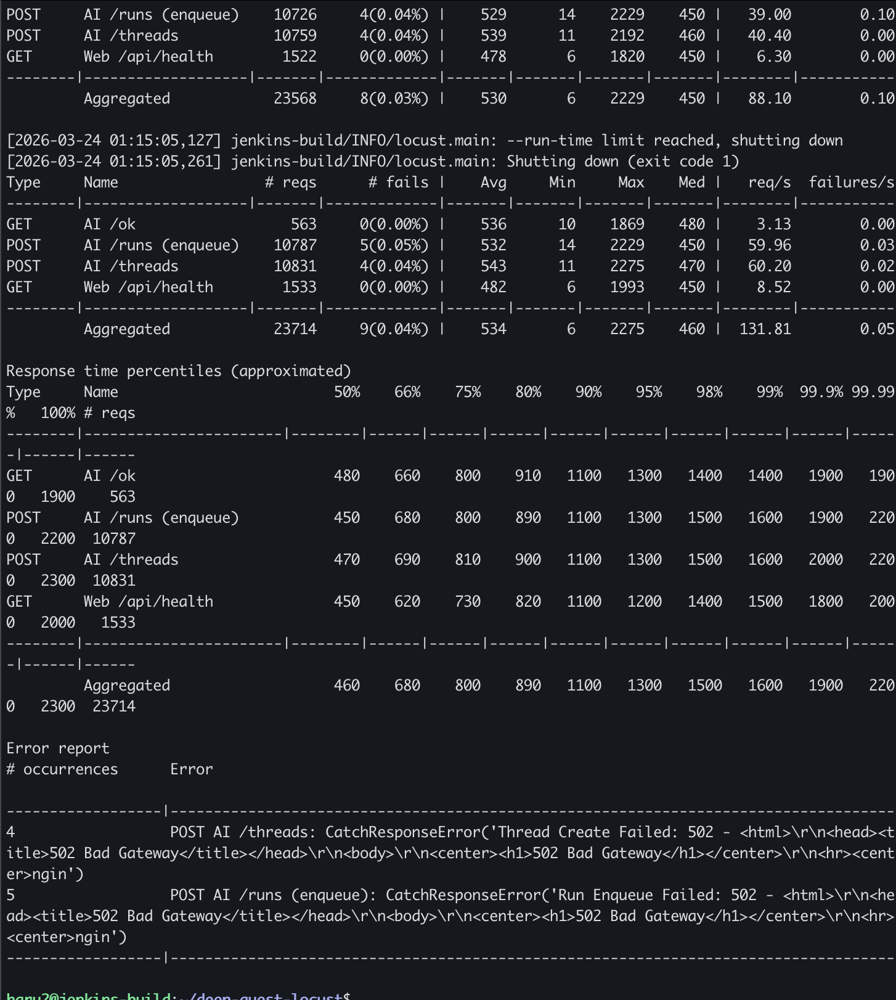

# DeepQuest Scaling Optimization

> backlog 기반 autoscaling이 실제 처리량 증가로 이어지도록 병목을 제거했습니다.

## Summary

- KEDA 적용 후에도 실제 처리량이 충분히 증가하지 않는 문제를 확인했습니다.
- 병목은 `ai-server cpu request`, `Postgres connection ceiling`, 동기 처리 구조에서 확인했습니다.
- `ai-server cpu request 1 -> 200m`, `Postgres max_connections 100 -> 500`으로 조정했습니다.
- 주요 AI 경로를 async로 전환했습니다.
- 최종적으로 `Jobs Completed/sec`를 약 `4 -> 20 ops/s`로 개선했습니다.
- queue backlog를 증가 상태에서 감소 상태로 전환했습니다.

## Key Results

- `ai-server available`: `4 -> 10`
- `Worker Busy`: `160 -> 400`
- `Jobs Completed/sec`: `4 -> 20`
- `Queue Backlog`: 증가 -> 감소
- `Worker Success Rate`: `100% 유지`
- Gemini API 호출량: 전역 rate limiter로 `60~70 RPS` 범위에서 제어했습니다.

## Performance Comparison

| Metric | Before | After |
|--------|--------|-------|
| Available Pods | ~4 | ~10 |
| Worker Busy | ~160 | ~400 |
| Completed/sec | ~4 | ~20 |
| Queue Backlog | 증가 | 감소 |
| Success Rate | 100% | 100% |

---

## 1. 문제 정의

DeepQuest는 Web 계층은 높은 요청량을 받을 수 있었지만, 실제 AI 처리 계층은 비동기 run backlog가 빠르게 쌓이며 처리 완료율이 낮았습니다.

주요 문제는 다음과 같았습니다.

- worker는 포화되는데 실제 완료 처리량은 낮았습니다.
- CPU/Memory만으로는 실제 병목이 잘 보이지 않았습니다.
- CPU 기반 HPA는 backlog 증가에 적절히 반응하지 못했습니다.
- 외부 Gemini API는 별도 rate limit 보호가 필요했습니다.

---

## 2. 시스템 구조

아키텍처 이미지는 여기에 추가할 예정입니다.

- Web API: 요청을 접수했습니다.
- LangGraph Runtime: run 생성 및 상태 관리를 담당했습니다.
- Redis: 전역 rate limiting과 보조 상태 저장에 사용했습니다.
- Postgres: run, thread, checkpoint 저장에 사용했습니다.
- AI Worker: 실제 Gemini 호출을 수행했습니다.
- Prometheus + Grafana: backlog, worker, latency, HPA를 모니터링했습니다.
- KEDA: backlog 기반 autoscaling을 수행했습니다.

---

## 3. Experiment Goal

- `concurrent_max=40`에서 worker saturation이 발생하는지 확인했습니다.
- 초과 요청이 실패 대신 backlog로 적체되는지 확인했습니다.
- KEDA가 backlog 기반으로 `ai-server`를 scale-out 하는지 확인했습니다.
- scale-out이 실제 처리량 증가로 이어지는지 확인했습니다.
- 외부 Gemini API 호출량이 전역 rate limiter로 통제되는지 확인했습니다.

---

## 4. 1차 실험: concurrent_max=40 검증

### 설정

- `concurrent_max=40`
- queue metrics exporter + Grafana 대시보드 적용
- Locust로 AI enqueue 부하 생성

### 결과

- `Worker Busy`가 설정값 근처에서 포화됐습니다.
- `Queue Backlog`가 빠르게 증가했습니다.
- `Jobs Failed/sec`는 거의 `0`이었습니다.
- 초과 요청은 즉시 실패보다 backlog 적체 형태로 보호됐습니다.

참고 증거:
- [concurrent_max=40 정리](../evidence/concurrent_max=40/README.md)
- [핵심 로그](../evidence/concurrent_max=40/ai-load-test-important-logs.txt)

---

## 5. KEDA 적용

### 설정

- `ScaledObject`
- metric: `sum(ai_job_queue_pending)`
- threshold: `40`
- `minReplicaCount=1`
- `maxReplicaCount=10`

### 초기 결과

- `desired replica=10`까지 상승했습니다.
- 하지만 실제 `available replica`는 `4` 수준에서 멈췄습니다.
- autoscaler는 동작했지만, 실제 가용 파드 증가는 제한됐습니다.

---

## 6. 병목 분석

### 6.1 스케줄링 병목

- `ai-server cpu request = 1`
- Kubernetes scheduler는 실사용량이 아니라 request 기준으로 배치했습니다.
- 그 결과 실제 CPU 사용률은 낮아도 추가 pod가 스케줄되지 못했습니다.

### 6.2 DB connection 병목

- 기본 `max_connections = 100`
- 부하 시 실제로 `too many clients already`가 발생했습니다.
- LangGraph runtime, exporter, worker가 모두 같은 Postgres를 직접 사용했습니다.

### 6.3 애플리케이션 처리 병목

- `resume_parser`의 동기 PDF 다운로드
- `.invoke()` 기반 동기 LLM 호출
- 동기 stream 루프
- worker가 외부 응답 대기 동안 오래 점유되는 구조

---

## 7. 개선 작업

### 7.1 관측

- `langgraph.run` 기반 queue metrics exporter를 추가했습니다.
- Grafana에서 다음 지표를 볼 수 있게 구성했습니다.
  - `Worker Busy`
  - `Queue Backlog`
  - `Jobs Completed/sec`
  - `Jobs Failed/sec`
  - `Worker Success Rate`

### 7.2 외부 API 보호

- Redis 기반 전역 rate limiter를 적용했습니다.
- Gemini 호출량을 약 `60 RPS` 수준으로 제한했습니다.

### 7.3 인프라/설정 개선

- `Postgres max_connections`: `100 -> 200 -> 500`
- Postgres memory limit를 상향했습니다.
- `ai-server cpu request`: `1 -> 200m`

### 7.4 애플리케이션 개선

- `resume_parser` 다운로드 경로를 async로 전환했습니다.
- `question_feedback_gen`, `question_gen`, `jd_structuring`을 async로 전환했습니다.
- `jd_to_text` native stream / langchain stream 경로를 async로 정리했습니다.

---

## 8. 개선 후 재실험 결과

가장 의미 있는 결과는 `2단계_retry_2`에서 나왔습니다.

### 주요 수치

- `ai-server available`: `4 -> 10`
- `Worker Busy`: `160 -> 400`
- `Jobs Completed/sec`: `4 -> 20`
- `Queue Backlog`: 증가 -> 감소
- `Worker Success Rate`: `100% 유지`
- `Jobs Failed/sec`: 거의 `0`

### Locust 기준

- `100 virtual users`
- aggregate 약 `131.81 req/s`
- 실패율 약 `0.04%`

### 결과

- `ai-server`가 실제로 `10개`까지 scale-out됐습니다.
- worker 수가 `400` 수준까지 증가했습니다.
- `Jobs Completed/sec`가 약 `20 ops/s` 수준까지 상승했습니다.
- queue backlog가 누적이 아니라 감소로 전환됐습니다.

-> scale-out이 실제 처리량 증가로 연결됐습니다.

참고 증거:
- [2단계 retry 2 요약](../evidence/keda/2단계_retry_2/summary.md)
- [2단계 retry 2 로그](../evidence/keda/2단계_retry_2/step2-medium-load-retry-2-logs.txt)

---

## 9. Key Results Detail

- `concurrent_max=40`으로 worker 보호를 먼저 검증했습니다.
- queue metric 기반으로 backlog를 관측했습니다.
- Redis 기반 전역 rate limiter로 외부 Gemini quota를 보호했습니다.
- KEDA로 backlog 기반 autoscaling을 적용했습니다.
- CPU request와 DB connection ceiling이 실제 scale-out 병목임을 확인했습니다.
- async 전환을 포함한 애플리케이션 개선을 적용했습니다.
- 최종적으로 scale-out이 실제 처리량 증가와 backlog 감소로 이어졌습니다.

---

## 10. 배운 점

- CPU 사용률이 낮다고 해서 스케줄링 문제가 없는 것은 아니었습니다.
- Kubernetes에서는 실사용량보다 `request`가 더 중요한 병목이 될 수 있었습니다.
- backlog 기반 autoscaling은 observability가 먼저 갖춰져야 의미가 있었습니다.
- KEDA는 잘 동작해도, 실제 처리량은 애플리케이션 구조와 DB 상태에 크게 좌우됐습니다.
- rate limiter, autoscaling, async 리팩터링은 따로가 아니라 함께 설계해야 했습니다.

---

## 11. 한 줄 결론

100 virtual users 기준 약 `130 req/s`의 지속 부하 환경에서, backlog 기반 KEDA, Redis 전역 rate limiting, Postgres connection 상향, `ai-server` CPU request 조정, 주요 AI 경로 async 전환을 통해 처리율을 약 `20 ops/s`까지 끌어올리고 queue backlog를 실제로 감소시키는 단계까지 검증했습니다.

