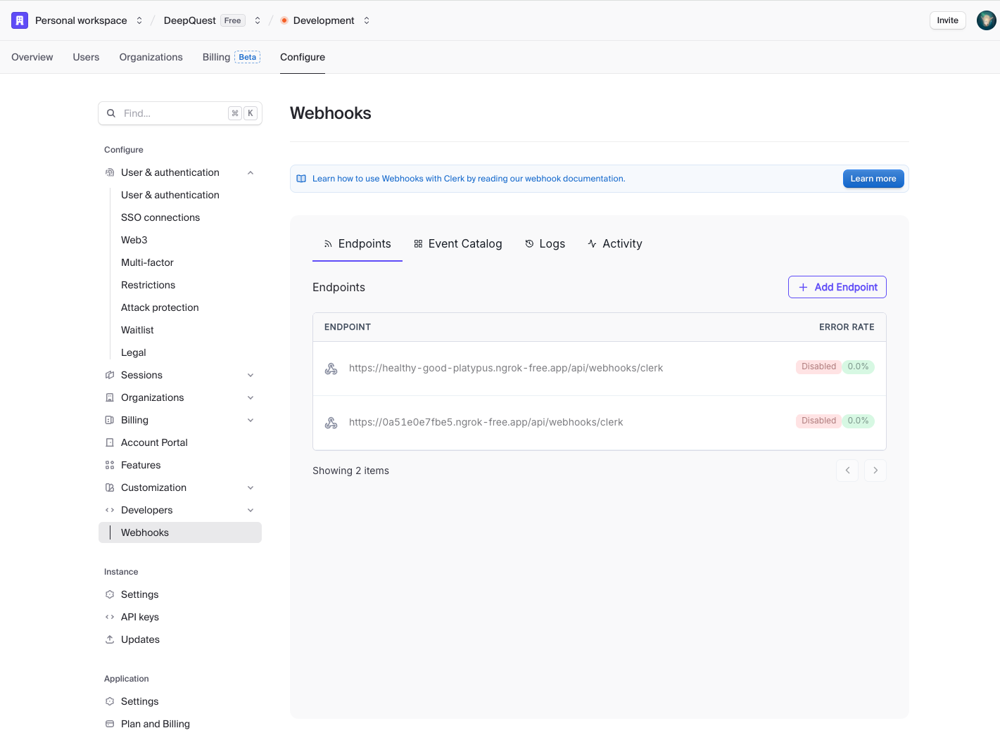

# Deep Quest

AI-powered technical interview coaching platform.

## Prerequisites

### Web (Next.js)

- Node.js >= 22.0.0
- pnpm >= 9.0.0
- Docker (Supabase 로컬 실행용)

### AI Server (Python LangGraph)

- Python >= 3.11
- [uv](https://docs.astral.sh/uv/) (Python package manager)

## Project Structure

```
deep-quest/
├── web/              # Next.js Full-Stack Application
│   ├── src/          # Application code
│   └── prisma/       # Database schema
│
└── ai/               # Python LangGraph AI Server
    ├── src/          # AI processing graphs
    └── tests/        # AI server tests
```

## Environment Setup

각 프로젝트의 `.env.example` 파일을 참고하여 환경변수를 설정하세요.

```bash
# Web
cp web/.env.example web/.env.local

# AI Server
cp ai/.env.example ai/.env
```

### Supabase (Local Development)

로컬에서 Supabase를 실행하여 개발합니다. Docker가 필요합니다.

- [Supabase - Local Development Guide](https://supabase.com/docs/guides/local-development)

### Clerk Webhook (Local Development)

로컬 환경에서 Clerk 웹훅을 테스트하려면 ngrok을 사용해야 합니다.

(local 환경에서 최초 회원가입 시 필수)

- [Clerk - Testing webhooks locally with ngrok](https://ngrok.com/partners/clerk)

## Getting Started (최초 설정)

### 1. Docker 실행

```bash
# Docker Desktop 실행 확인
docker --version
```

### 2. Supabase 로컬 실행

```bash
cd web

# Supabase 시작 (최초 실행 시 이미지 다운로드로 시간 소요)
설치 방법에 맞게 supabase 실행(`supabase strat`)
```

실행 후 출력되는 `API URL`, `anon key`, `service_role key` 등을 `.env.local`에 설정합니다.

### 3. 환경변수 설정

```bash
cp web/.env.example web/.env.local
cp ai/.env.example ai/.env
```

**Web:**

- Supabase: 위에서 출력된 값 입력
- Clerk: 관리자에게 Development 키 요청 또는 Clerk 대시보드에서 확인

**AI Server:**

- LangSmith: [LangSmith](https://smith.langchain.com/) 회원가입 후 API 키 발급
- Google API: [Google AI Studio](https://aistudio.google.com/)에서 API 키 발급

### 4. Clerk & ngrok 설정 (최초 회원가입 시 필수)

로컬에서 Clerk 웹훅을 받으려면 ngrok으로 터널링이 필요합니다.

1. **ngrok 실행(ngrok 회원가입 후, Getting started 참고)**

   ```bash
   ngrok http 3000
   ```
2. **Clerk 대시보드에서 웹훅 URL 설정**

   [Clerk Dashboard](https://dashboard.clerk.com) → Configure → Webhooks에서 ngrok URL을 입력합니다.

   

   - Endpoint URL: `https://<ngrok-subdomain>/api/webhooks/clerk`
   - 필요한 이벤트 구독 (user.created, user.updated 등)

### 5. 의존성 설치 & DB 마이그레이션

```bash
# Web
cd web
pnpm install
pnpm db:generate
pnpm db:migrate

# AI Server
cd ../ai
uv sync
```

### 6. 개발 서버 실행

```bash
# Web (터미널 1)
cd web
pnpm dev

# AI Server (터미널 2)
cd ai
uv run langgraph dev
```

- Web: http://localhost:3000
- AI Server: http://localhost:8123

## Development Commands

### Web

| Command              | Description                        |
| -------------------- | ---------------------------------- |
| `pnpm dev`         | Start development server           |
| `pnpm build`       | Build for production               |
| `pnpm check-all`   | Run type-check, lint, format check |
| `pnpm test`        | Run tests                          |
| `pnpm db:studio`   | Open Prisma Studio GUI             |
| `pnpm db:migrate`  | Create and apply migration         |
| `pnpm db:generate` | Generate Prisma Client             |

### AI Server

| Command                  | Description                |
| ------------------------ | -------------------------- |
| `uv run langgraph dev` | Start LangGraph dev server |
| `uv run make test`     | Run unit tests             |
| `uv run make lint`     | Run linting (ruff + mypy)  |
| `uv run make format`   | Format code                |

## Code Quality

### Before Committing

**Web:**

```bash
pnpm check-all
```

**AI Server:**

```bash
uv run make lint
```

## Tech Stack

|           | Web                            | AI Server      |
| --------- | ------------------------------ | -------------- |
| Language  | TypeScript                     | Python 3.11+   |
| Framework | Next.js 16                     | LangGraph      |
| Database  | PostgreSQL (Supabase) + Prisma | -              |
| Auth      | Clerk                          | -              |
| API       | tRPC                           | LangGraph HTTP |
| Testing   | Vitest                         | pytest         |
