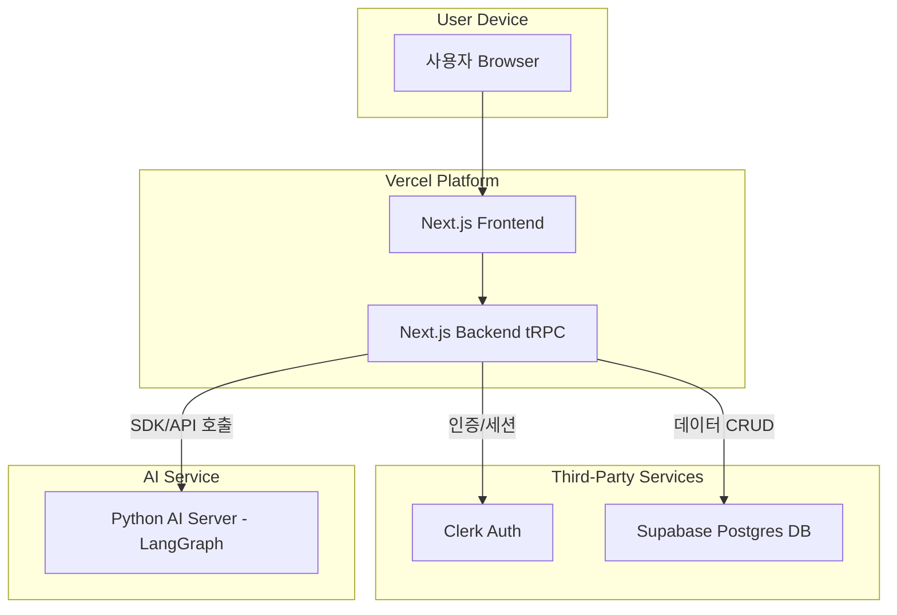
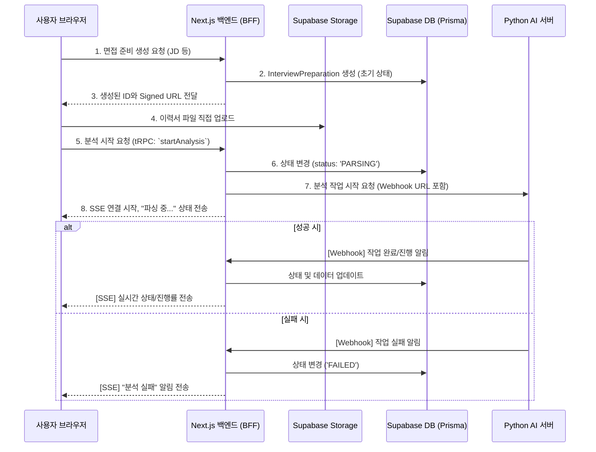

# AI Interview Coaching Service Fullstack Architecture Document

## 1. Introduction

이 문서는 'AI 면접 코칭 서비스'의 전체 풀스택 아키텍처를 설명하며, 백엔드 시스템, 프론트엔드 구현 및 두 영역의 통합 방안을 포함합니다. 이 문서는 AI 기반 개발의 단일 진실 공급원(Single Source of Truth) 역할을 하여 전체 기술 스택의 일관성을 보장하는 것을 목표로 합니다.

### Starter Template or Existing Project

제시된 기술 스택(Next.js, tRPC, Prisma, Clerk)은 현대적인 웹 애플리케이션 개발에서 검증된 조합입니다. T3 스택의 구조 및 모범 사례와 유사하므로, 해당 개발 철학을 기반으로 프로젝트를 구성하여 초기 개발 속도와 유지보수성을 확보합니다.

---

## 2. High Level Architecture

### Technical Summary

본 시스템의 아키텍처는 \*\*Next.js 통합 애플리케이션(`front`)\*\*과 \*\*Python LangGraph AI 서버(`ai`)\*\*로 구성된 명확한 분리형 구조를 유지하며, \*\*각각 독립된 저장소(Polyrepo)\*\*로 관리됩니다. Next.js 앱은 사용자 인터페이스, tRPC 백엔드, 데이터베이스 통신(Prisma), 인증(Clerk)을 모두 처리하며 Vercel에 배포됩니다. 긴 분석 작업의 결과는 \*\*Webhook과 SSE(Server-Sent Events)\*\*를 통해 클라이언트에 실시간으로 전달됩니다.

### Platform and Infrastructure Choice

- **플랫폼 (Platform):** Vercel 및 Supabase
- **주요 서비스 (Key Services):**
  - **Vercel:** Next.js 애플리케이션 호스팅, Serverless Functions, CI/CD
  - **Supabase:** PostgreSQL 데이터베이스, 스토리지 (이력서 파일 저장용)
  - **Clerk:** 사용자 인증 및 세션 관리
- **배포 호스트 및 지역 (Deployment Host and Regions):** Vercel (글로벌 엣지 네트워크), Supabase (ap-northeast-2, 서울)

### Repository Structure

- **구조 (Structure):** 다중 저장소 (Polyrepo / Multi-repo)
- **저장소 구성 (Repository Organization):**
  - `front-end-repo`: Next.js 풀스택 애플리케이션
  - `ai-server-repo`: Python LangGraph AI 서버 (사용자가 추후 별도 반영)

### High Level Architecture Diagram



---

## 3. Tech Stack

| 카테고리               | 기술                 | 버전           | 목적                       | 선정 이유                                                |
| :--------------------- | :------------------- | :------------- | :------------------------- | :------------------------------------------------------- |
| **Package Manager**    | pnpm                 | ^9             | 패키지 관리                | 빠른 설치 속도, 효율적인 디스크 사용, 엄격한 의존성 관리 |
| **Frontend Language**  | TypeScript           | ^5             | 타입 안정성 확보           | 코드 안정성 및 개발자 경험 향상                          |
| **Frontend Framework** | Next.js (App Router) | 15.4.5         | 웹 애플리케이션 프레임워크 | React Server Components, 성능 최적화, Vercel 통합        |
| **UI Component**       | shadcn/ui            | -              | UI 컴포넌트 구성           | Tailwind CSS 기반의 높은 커스터마이징 자유도             |
| **State Management**   | Zustand              | ^5.0.7         | 클라이언트 상태 관리       | 가볍고 직관적인 API, 적은 보일러플레이트                 |
| **Data Fetching**      | TanStack Query       | (tRPC wrapper) | 서버 상태 관리 및 캐싱     | tRPC와 함께 사용하여 API 데이터 페칭, 캐싱, 동기화       |
| **API Style**          | tRPC                 | ^11.4.4        | Next.js 백엔드 API         | 프론트-백엔드 간 완전한 타입 안정성 보장                 |
| **Database**           | PostgreSQL           | 15+            | 주 데이터베이스            | Supabase를 통해 제공, 검증된 안정성과 확장성             |
| **ORM**                | Prisma               | ^6.13.0        | 데이터베이스 통신          | 타입-안전한 데이터베이스 접근, 스키마 관리 용이성        |
| **File Storage**       | Supabase Storage     | latest         | 이력서 파일 저장           | 쉬운 파일 업로드/관리 API 제공                           |
| **Authentication**     | Clerk                | ^6.30.0        | 사용자 인증                | Next.js와 완벽히 통합된 인증 및 사용자 관리 솔루션       |
| **Frontend Testing**   | Vitest, RTL          | ^3.2.4         | 컴포넌트 단위/통합 테스트  | 빠르고 설정이 간편한 최신 테스트 프레임워크              |
| **CSS Framework**      | Tailwind CSS         | ^4             | UI 스타일링                | 빠른 UI 개발 및 일관된 디자인 시스템 구축                |
| **i18n**               | next-intl            | ^3.28.0        | 다국어 지원                | Next.js App Router와 완벽 호환, 타입 안전한 번역 키      |

### TypeScript Type Rules

**중요:** 이 프로젝트의 모든 TypeScript 코드는 **`docs/web/rules/typing-rules.md`**에 정의된 타입 규칙을 **반드시 준수**해야 합니다. 해당 문서는 프로젝트의 타입 안정성과 코드 일관성을 보장하기 위한 필수 가이드라인을 포함하고 있으며, 모든 개발자는 코드 작성 시 이 규칙을 참조하고 따라야 합니다.

### JSDoc Documentation Rules

**필수:** 모든 **public 인터페이스**에는 JSDoc 주석을 작성해야 합니다:

#### 문서화 대상

- **Public Functions/Methods**: 외부에서 호출 가능한 모든 함수
- **Public Types/Interfaces**: export되는 타입 및 인터페이스
- **Public Classes**: export되는 클래스 및 주요 메서드
- **API Endpoints**: tRPC 프로시저 및 라우터
- **Utility Functions**: 공용 유틸리티 함수
- **React Components**: Props 인터페이스 및 주요 컴포넌트

#### 필수 포함 내용

- **@param**: 모든 매개변수 (타입, 이름, 설명)
- **@returns**: 반환값 타입과 설명
- **@throws**: 발생 가능한 예외/에러
- **@example**: 복잡한 함수의 사용 예시

#### JSDoc 작성 예시

````typescript
/**
 * 면접 준비 데이터를 생성하고 AI 분석을 시작합니다.
 *
 * @param userData - 사용자 입력 데이터
 * @param userData.companyName - 면접 대상 회사명
 * @param userData.jobTitle - 지원 직무
 * @param userData.jobDescription - 직무 설명서
 * @returns Promise<InterviewPreparation> 생성된 면접 준비 객체
 * @throws {ValidationError} 입력 데이터가 유효하지 않을 때
 * @throws {AIServerError} AI 서버 연결 실패시
 * @example
 * ```typescript
 * const prep = await createInterviewPreparation({
 *   companyName: "Google",
 *   jobTitle: "Frontend Engineer",
 *   jobDescription: "React 및 TypeScript 경험 필수"
 * });
 * ```
 */
export async function createInterviewPreparation(
  userData: CreateInterviewData
): Promise<InterviewPreparation>;
````

---

## 4. Data Model (Prisma Schema)

```prisma
generator client {
  provider = "prisma-client-js"
}

datasource db {
  provider = "postgresql"
  url      = env("DATABASE_URL")
}

model User {
  id                    String                 @id @unique
  email                 String
  interviewPreparations InterviewPreparation[]
  @@map("users")
}

model InterviewPreparation {
  id             String     @id @default(cuid())
  userId         String
  user           User       @relation(fields: [userId], references: [id], onDelete: Cascade)
  companyName    String
  jobTitle       String
  jobDescription String     @db.Text
  status         JobStatus  @default(PROCESSING)
  createdAt      DateTime   @default(now())
  updatedAt      DateTime   @updatedAt
  questions      Question[]
  resume         Resume?
  @@index([userId])
  @@map("interview_preparations")
}

model Resume {
  id                     Int                    @id @default(autoincrement())
  interviewPreparationId String                 @unique
  interviewPreparation   InterviewPreparation   @relation(fields: [interviewPreparationId], references: [id], onDelete: Cascade)
  profile                CandidateProfile?
  educations             CandidateEducation[]
  careers                CareerExperience[]
  projects               ProjectExperience[]
  createdAt              DateTime               @default(now())
  @@map("resumes")
}

model CandidateProfile {
  id              Int      @id @default(autoincrement())
  resumeId        Int      @unique
  resume          Resume   @relation(fields: [resumeId], references: [id], onDelete: Cascade)
  name            String
  desiredPosition String
  objective       String   @db.Text
  createdAt       DateTime @default(now())
  @@map("candidate_profiles")
}

model CandidateEducation {
  id          Int      @id @default(autoincrement())
  resumeId    Int
  resume      Resume   @relation(fields: [resumeId], references: [id], onDelete: Cascade)
  institution String
  degree      String?
  major       String?
  startDate   String?  @db.VarChar(7)
  endDate     String?  @db.VarChar(7)
  description String   @db.Text
  @@index([resumeId])
  @@map("candidate_educations")
}

model CareerExperience {
  id                 Int          @id @default(autoincrement())
  resumeId           Int
  resume             Resume       @relation(fields: [resumeId], references: [id], onDelete: Cascade)
  company            String
  companyDescription String       @db.Text
  employeeType       EmployeeType
  jobLevel           String?
  startDate          String?      @db.VarChar(7)
  endDate            String?      @db.VarChar(7)
  techStack          String[]
  architecture       String?      @db.Text
  position           String[]
  summary            String       @db.Text
  situation          String[]
  task               String[]
  action             String[]
  result             String[]
  @@index([resumeId])
  @@map("career_experiences")
}

model ProjectExperience {
  id          Int         @id @default(autoincrement())
  resumeId    Int
  resume      Resume      @relation(fields: [resumeId], references: [id], onDelete: Cascade)
  projectName String
  projectType ProjectType
  teamSize    Int?
  startDate   String?     @db.VarChar(7)
  endDate     String?     @db.VarChar(7)
  techStack   String[]
  architecture String?    @db.Text
  position    String[]
  summary     String      @db.Text
  situation   String[]
  task        String[]
  action      String[]
  result      String[]
  @@index([resumeId])
  @@map("project_experiences")
}

model Question {
  id                     String                 @id @default(cuid())
  interviewPreparationId String
  interviewPreparation   InterviewPreparation   @relation(fields: [interviewPreparationId], references: [id], onDelete: Cascade)
  parentQuestionId       String?
  parentQuestion         Question?              @relation("FollowUp", fields: [parentQuestionId], references: [id], onDelete: NoAction, onUpdate: NoAction)
  followUpQuestions      Question[]             @relation("FollowUp")
  text                   String                 @db.Text
  category               String
  isCompleted            Boolean                @default(false)
  answers                Answer[]
  @@index([interviewPreparationId])
  @@map("questions")
}

model Answer {
  id         String    @id @default(cuid())
  questionId String
  question   Question  @relation(fields: [questionId], references: [id], onDelete: Cascade)
  text       String    @db.Text
  feedback   Feedback?
  @@index([questionId])
  @@map("answers")
}

model Feedback {
  id          String @id @default(cuid())
  answerId    String @unique
  answer      Answer @relation(fields: [answerId], references: [id], onDelete: Cascade)
  strengths   String @db.Text
  weaknesses  String @db.Text
  suggestions String @db.Text
  rating      Rating
  @@map("feedbacks")
}

enum JobStatus { PROCESSING, READY, FAILED }
enum Rating { DEEP, INTERMEDIATE, SURFACE }
enum EmployeeType { EMPLOYEE, INTERN, CONTRACT, FREELANCE }
enum ProjectType { PERSONAL, TEAM }
```

---

## 5. API Specification (tRPC Routers)

```typescript
import { z } from "zod";
import { createTRPCRouter, protectedProcedure } from "../trpc";

export const interviewPreparationRouter = createTRPCRouter({
  list: protectedProcedure.query(({ ctx }) => {
    /* ... */
  }),
  getById: protectedProcedure
    .input(z.object({ id: z.string() }))
    .query(({ ctx, input }) => {
      /* ... */
    }),
  create: protectedProcedure
    .input(/* ... */)
    .mutation(async ({ ctx, input }) => {
      /* ... */
    }),
  startAnalysis: protectedProcedure
    .input(z.object({ id: z.string() }))
    .mutation(async ({ ctx, input }) => {
      /* ... */
    }),
});

export const questionRouter = createTRPCRouter({
  listByPreparationId: protectedProcedure
    .input(/* ... */)
    .query(({ ctx, input }) => {
      /* ... */
    }),
});

export const answerRouter = createTRPCRouter({
  submit: protectedProcedure
    .input(/* ... */)
    .mutation(async ({ ctx, input }) => {
      /* ... */
    }),
});

export const appRouter = createTRPCRouter({
  interviewPreparation: interviewPreparationRouter,
  question: questionRouter,
  answer: answerRouter,
});

export type AppRouter = typeof appRouter;
```

---

## 6. Components

- **인증 컴포넌트:** Clerk SDK와 Next.js 미들웨어를 사용한 세션 관리.
- **대시보드 컴포넌트:** `interviewPreparation.list` tRPC 프로시저를 호출하여 면접 준비 목록 표시.
- **면접 준비 생성 컴포넌트:** Supabase Storage로 파일 업로드 후 `interviewPreparation.create` 호출.
- **면접 연습 세션 컴포넌트:** 질문/답변/피드백 UI 및 SSE를 통한 실시간 상태 업데이트 관리.
- **Next.js 백엔드 (BFF):** tRPC 요청 처리, Prisma를 통한 DB 통신, AI 서버 호출 및 권한 부여 로직 수행.

---

## 7. External APIs

- **Clerk API:** 사용자 인증 및 세션 관리.
- **Supabase API:** DB CRUD (Prisma 경유) 및 파일 스토리지 (Signed URL 방식).
- **Web Speech API (MVP):** 음성 답변의 텍스트 변환.

---

## 8. Core Workflow (Async Analysis)



---

## 9. Frontend Architecture and Development Workflow (Source Tree)

### Frontend Repository Structure

```text
/src
|-- /app
|   |-- /[locale]            # 언어별 라우팅
|   |   |-- /(public)        # 공개 영역 (비로그인)
|   |   |   |-- layout.tsx   # 상단 네비게이션 레이아웃
|   |   |   |-- page.tsx     # 랜딩 페이지
|   |   |   `-- /auth
|   |   |       `-- /signin
|   |   |           `-- page.tsx  # 로그인 페이지
|   |   `-- /(protected)     # 보호 영역 (로그인 필수)
|   |       |-- layout.tsx   # 사이드바 레이아웃 + 인증 체크
|   |       |-- /dashboard
|   |       |   |-- /_components
|   |       |   `-- page.tsx
|   |       `-- /interview-prep
|   |           |-- /new
|   |           |   `-- page.tsx
|   |           `-- /[id]
|   |               |-- page.tsx
|   |               `-- /[experienceType]/[experienceId]
|   |                   |-- page.tsx
|   |                   `-- /[questionId]
|   |                       `-- page.tsx
|   |-- /components
|   |   |-- /ui (shadcn/ui)
|   |   `-- /shared
|   |-- /lib
|   |   |-- /trpc
|   |   `-- /i18n            # i18n 설정
|   |-- /server/api
|   `-- /types
|-- /locales                 # 번역 파일
|   |-- /ko
|   |   `-- common.json
|   `-- /en
|       `-- common.json
|-- /prisma
|-- middleware.ts
`-- package.json
```

### Routing Structure

#### Route Groups 활용

- **`(public)`**: 비로그인 사용자 접근 가능 영역
  - 랜딩 페이지, 로그인 페이지
  - 상단 네비게이션 레이아웃 적용
- **`(protected)`**: 로그인 필수 영역
  - Clerk 인증 미들웨어로 보호
  - 사이드바 네비게이션 레이아웃 적용
  - 미인증 시 자동으로 로그인 페이지 리다이렉트

### URL Structure

| URL 패턴                                                                     | 페이지       | 인증 필요 | 설명               |
| ---------------------------------------------------------------------------- | ------------ | --------- | ------------------ |
| `/[locale]/`                                                                 | 랜딩         | ❌        | 서비스 소개        |
| `/[locale]/auth/signin`                                                      | 로그인       | ❌        | OAuth 로그인       |
| `/[locale]/dashboard`                                                        | 대시보드     | ✅        | 면접 준비 목록     |
| `/[locale]/interview-prep/new`                                               | 새 준비 생성 | ✅        | 이력서/JD 업로드   |
| `/[locale]/interview-prep/[id]`                                              | 준비 상세    | ✅        | 개별 준비 대시보드 |
| `/[locale]/interview-prep/[id]/[experienceType]/[experienceId]`              | 문제 목록    | ✅        | 문제 선택 화면     |
| `/[locale]/interview-prep/[id]/[experienceType]/[experienceId]/[questionId]` | 문제 풀이    | ✅        | 답변 및 피드백     |

#### Dynamic Routes

- `[locale]`: 언어 코드 (ko, en)
- `[id]`: 면접 준비 고유 ID
- `[questionId]`: 개별 문제 고유 ID

#### 재진입 정책

- 완료된 문제 재진입 시 읽기 전용 모드 활성화
- 이전 답변과 받은 피드백을 확인 가능
- 새로운 답변 제출은 불가능

---

## 10. Monitoring and Alerting Strategy

### Key Metrics

#### 애플리케이션 성능 메트릭

- **응답 시간:** tRPC API 엔드포인트별 평균/P95 응답 시간
- **AI 피드백 속도:** NFR1 준수 확인 (5초 이내 95%+ 달성률)
- **업타임:** 전체 서비스 가용성 (99.9% 목표)
- **오류율:** HTTP 4xx/5xx 응답 비율

#### 비즈니스 메트릭

- **면접 준비 성공률:** 분석 실패 대비 성공 완료 비율
- **AI 서버 작업 성공률:** 이력서 분석 → 질문 생성 → 피드백 생성 성공률
- **사용자 세션 길이:** 평균 연습 세션 지속 시간
- **파일 업로드 성공률:** 이력서 업로드 실패 비율

### Monitoring Tools Stack

#### Vercel Analytics & Speed Insights

- **자동 통합:** Next.js 애플리케이션 성능 실시간 모니터링
- **Core Web Vitals:** LCP, FID, CLS 자동 추적
- **사용자 경험:** 실제 사용자 데이터 기반 성능 분석

#### Supabase 모니터링

- **데이터베이스 성능:** 쿼리 성능, 연결 풀 상태 모니터링
- **스토리지 사용량:** 이력서 파일 스토리지 사용량 및 성능 추적

#### 커스텀 로깅 (Next.js)

```typescript
// utils/logger.ts 예시
export const logAIServerRequest = (
  action: string,
  duration: number,
  success: boolean
) => {
  console.log(
    JSON.stringify({
      timestamp: new Date().toISOString(),
      service: "ai-server",
      action,
      duration_ms: duration,
      success,
      environment: process.env.NODE_ENV,
    })
  );
};
```

### Alerting Strategy

#### 즉시 대응 필요 (Critical - Slack/Email)

- **AI 서버 5분+ 무응답:** 사용자 경험 직접 영향
- **데이터베이스 연결 실패:** 전체 서비스 중단
- **오류율 10%+ 지속:** 시스템 장애 징후

#### 모니터링 필요 (Warning - Slack)

- **AI 피드백 응답시간 7초+ (NFR1 위반)**
- **면접 준비 생성 실패율 20%+ 증가**
- **파일 업로드 실패율 15%+ 증가**

#### 추세 관찰 (Info - Dashboard)

- **일일 사용자 수 변화**
- **평균 연습 세션 길이 변화**
- **인기 면접 준비 카테고리**

### Dashboard Configuration

#### Real-time Dashboard (Vercel + Custom)

- **시스템 상태:** 모든 서비스(Next.js, Supabase, AI 서버) 연결 상태
- **성능 메트릭:** 실시간 응답 시간, 처리량 차트
- **사용자 활동:** 현재 활성 사용자, 진행 중인 분석 작업

#### Weekly Report (자동화)

- **주간 성능 요약**
- **사용자 행동 패턴 분석**
- **AI 서버 성능 및 실패 원인 분석**
- **액션 아이템 및 개선 포인트**

---

## 11. UI-First Development Strategy

### Development Order

#### Phase 1: UI 프로토타입 (Week 1-2)

- **목표:** 목업 데이터로 작동하는 완전한 프론트엔드
- **기술:** Next.js, TypeScript, Tailwind CSS, shadcn/ui, next-intl
- **산출물:** 사용성 테스트 가능한 프로토타입 (한/영 언어 지원)

#### Phase 2: 기본 백엔드 (Week 3)

- **목표:** 데이터베이스와 인증 통합
- **기술:** Prisma, Supabase, Clerk
- **산출물:** 실제 데이터 저장 및 사용자 관리

#### Phase 3: API 레이어 (Week 3-4)

- **목표:** 프론트엔드-백엔드 연결
- **기술:** tRPC, React Query
- **산출물:** 타입 안전한 API 통신

#### Phase 4: AI 통합 (Week 4-5)

- **목표:** AI 서버 연동 및 실제 기능 구현
- **기술:** Python AI Server, SSE, Webhooks
- **산출물:** MVP 완성

### Mock Data Strategy

#### 타입 정의 (Type Definitions)

```typescript
// src/types/mock.ts
interface MockInterviewPreparation {
  id: string;
  companyName: string;
  jobTitle: string;
  jobDescription?: string;
  status: "PROCESSING" | "READY" | "FAILED";
  progress: number; // 0-100
  questionsCount: number;
  completedCount: number;
  createdAt: string;
  updatedAt: string;
}

interface MockQuestion {
  id: string;
  preparationId: string;
  text: string;
  category: "career" | "project" | "technical" | "behavioral";
  isCompleted: boolean;
  rating?: "DEEP" | "INTERMEDIATE" | "SURFACE";
  parentQuestionId?: string; // 심층 질문용
}

interface MockAnswer {
  id: string;
  questionId: string;
  text: string;
  createdAt: string;
}

interface MockFeedback {
  answerId: string;
  strengths: string[];
  weaknesses: string[];
  suggestions: string[];
  rating: "DEEP" | "INTERMEDIATE" | "SURFACE";
  followUpQuestions: string[]; // 심층 질문 ID들
}
```

#### 샘플 데이터 (Sample Data)

```typescript
// src/lib/mock-data/interview-preparations.ts
export const mockInterviewPreparations: MockInterviewPreparation[] = [
  {
    id: "1",
    companyName: "Google",
    jobTitle: "Senior Frontend Engineer",
    jobDescription: "Build next-generation web applications...",
    status: "READY",
    progress: 60,
    questionsCount: 15,
    completedCount: 9,
    createdAt: "2025-08-10T10:00:00Z",
    updatedAt: "2025-08-11T14:30:00Z",
  },
  {
    id: "2",
    companyName: "Meta",
    jobTitle: "React Developer",
    status: "PROCESSING",
    progress: 0,
    questionsCount: 0,
    completedCount: 0,
    createdAt: "2025-08-11T15:00:00Z",
    updatedAt: "2025-08-11T15:00:00Z",
  },
  {
    id: "3",
    companyName: "Amazon",
    jobTitle: "Full Stack Engineer",
    status: "FAILED",
    progress: 0,
    questionsCount: 0,
    completedCount: 0,
    createdAt: "2025-08-09T09:00:00Z",
    updatedAt: "2025-08-09T09:05:00Z",
  },
];

// src/lib/mock-data/questions.ts
export const mockQuestions: Record<string, MockQuestion[]> = {
  "1": [
    // Google preparation
    {
      id: "q1",
      preparationId: "1",
      text: "React의 Virtual DOM 동작 원리를 설명하고, 실제 프로젝트에서 성능 최적화를 위해 어떻게 활용했는지 설명해주세요.",
      category: "technical",
      isCompleted: true,
      rating: "DEEP",
    },
    {
      id: "q2",
      preparationId: "1",
      text: "이력서에 작성하신 '대시보드 성능 개선 프로젝트'에서 구체적으로 어떤 기술적 도전이 있었나요?",
      category: "career",
      isCompleted: true,
      rating: "INTERMEDIATE",
    },
    {
      id: "q3",
      preparationId: "1",
      text: "마이크로프론트엔드 아키텍처의 장단점은 무엇인가요?",
      category: "technical",
      isCompleted: false,
    },
  ],
};

// src/lib/mock-data/feedback.ts
export const mockFeedback: Record<string, MockFeedback> = {
  a1: {
    answerId: "a1",
    strengths: [
      "Virtual DOM의 기본 개념을 정확히 이해하고 있습니다",
      "Reconciliation 과정을 구체적으로 설명했습니다",
    ],
    weaknesses: [
      "Fiber 아키텍처에 대한 언급이 부족합니다",
      "실제 프로젝트 적용 사례가 구체적이지 않습니다",
    ],
    suggestions: [
      "React 18의 Concurrent Features와 연관지어 설명하면 좋겠습니다",
      "메모이제이션 기법 활용 사례를 추가하세요",
    ],
    rating: "INTERMEDIATE",
    followUpQuestions: ["q4", "q5"],
  },
};
```

### i18n Implementation Strategy

```typescript
// src/lib/i18n/config.ts
export const locales = ["ko", "en"] as const;
export const defaultLocale = "ko" as const;

// src/lib/i18n/translations.ts
import { getRequestConfig } from "next-intl/server";

export default getRequestConfig(async ({ locale }) => ({
  messages: (await import(`@/locales/${locale}/common.json`)).default,
}));

// Component usage example
import { useTranslations } from "next-intl";

export function DashboardHeader() {
  const t = useTranslations("dashboard");
  return <h1>{t("title")}</h1>;
}
```

### Progressive Integration Pattern

```typescript
// Phase 1: Mock Service
class MockInterviewService {
  async getPreparations() {
    return mockInterviewPreparations;
  }
}

// Phase 2-3: Real Service
class InterviewService {
  async getPreparations() {
    return await trpc.interviewPreparation.list.query();
  }
}

// Service Factory
export const interviewService = process.env.USE_MOCK_DATA
  ? new MockInterviewService()
  : new InterviewService();
```

## 12. Change Log

| 날짜       | 버전 | 설명                                                  | 작성자              |
| :--------- | :--- | :---------------------------------------------------- | :------------------ |
| 2025-08-11 | 1.0  | 아키텍처 문서 초안 작성 및 완성                       | Winston (Architect) |
| 2025-08-11 | 1.1  | UI-First 개발 전략 추가                               | Sarah (PO)          |
| 2025-08-11 | 1.2  | i18n 기술 스택 및 구현 전략 추가                      | Sarah (PO)          |
| 2025-08-11 | 1.3  | 상세 Mock 데이터 구조 정의, 컴포넌트 개발 전략 명확화 | Sarah (PO)          |
| 2025-08-11 | 1.4  | MVP 간소화를 위한 Storybook 제거, 직접 개발 방식 채택 | Sarah (PO)          |
