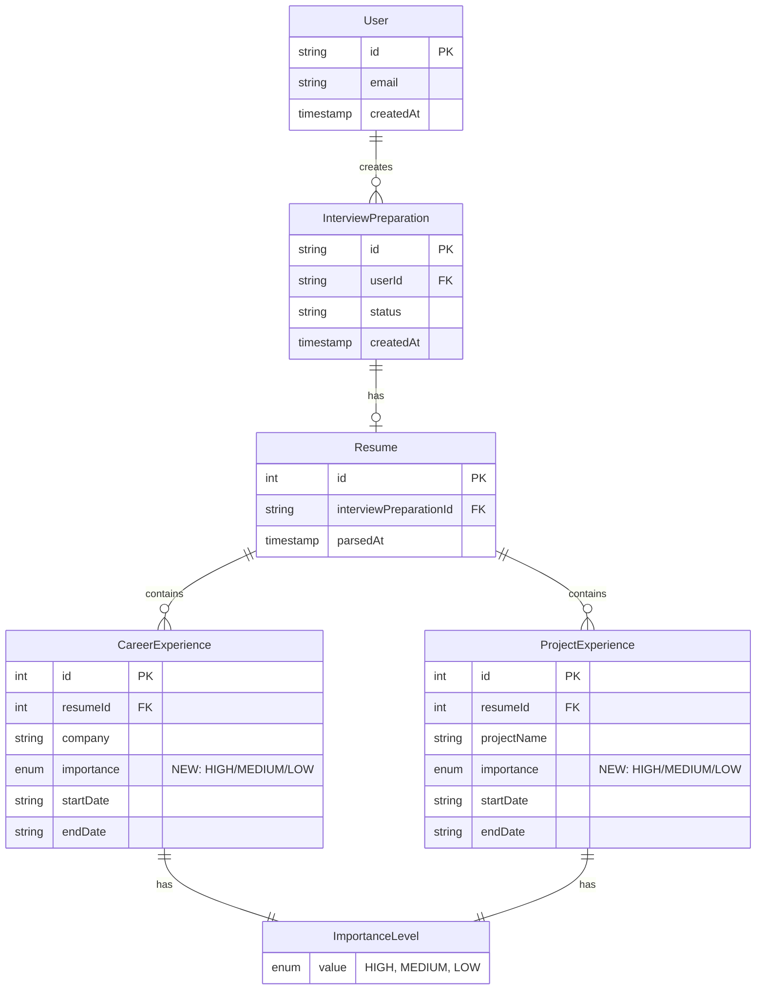

# Data Model: Experience Importance Visualization

**Feature**: 001-experience-importance-visualization
**Date**: 2025-10-13
**Phase**: 1 - Data Model Design

## Overview

This document defines the data model changes required to support AI-generated and user-editable importance ratings for resume experiences. The changes span both the **frontend database** (Prisma/PostgreSQL) and **AI server schemas** (Pydantic).

---

## 1. Database Schema Changes (Prisma)

### 1.1 New Enum: ImportanceLevel

**Location**: `/web/prisma/schema.prisma`

```prisma
enum ImportanceLevel {
  HIGH    // 3 stars - Most relevant to target job
  MEDIUM  // 2 stars - Moderately relevant (default)
  LOW     // 1 star - Least relevant
}
```

**Purpose**: Type-safe representation of experience importance for interview preparation

**Mapping to UI**:

- `HIGH` → ⭐⭐⭐ (3 filled stars)
- `MEDIUM` → ⭐⭐ (2 filled stars)
- `LOW` → ⭐ (1 filled star)

---

### 1.2 Updated Entity: CareerExperience

**Location**: `/web/prisma/schema.prisma`

```prisma
model CareerExperience {
  id                 Int              @id @default(autoincrement())
  resumeId           Int
  resume             Resume           @relation(fields: [resumeId], references: [id], onDelete: Cascade)

  // Existing fields
  company            String
  companyDescription String
  employeeType       EmployeeType
  jobLevel           String?
  startDate          String?          @db.VarChar(7)
  endDate            String?          @db.VarChar(7)
  techStack          String[]
  architecture       String?
  position           String[]
  situation          String[]
  task               String[]
  action             String[]
  result             String[]

  // ✨ NEW FIELD
  importance         ImportanceLevel  @default(MEDIUM)

  @@index([resumeId])
  @@index([resumeId, importance, endDate]) // Composite index for sorted queries
  @@map("career_experiences")
}
```

**Changes**:

- **Added**: `importance ImportanceLevel @default(MEDIUM)`
- **Added**: Composite index `[resumeId, importance, endDate]` for optimized sorting

**Default Value**: `MEDIUM` ensures backward compatibility and handles cases where AI doesn't assign a rating

---

### 1.3 Updated Entity: ProjectExperience

**Location**: `/web/prisma/schema.prisma`

```prisma
model ProjectExperience {
  id          Int              @id @default(autoincrement())
  resumeId    Int
  resume      Resume           @relation(fields: [resumeId], references: [id], onDelete: Cascade)

  // Existing fields
  projectName String
  projectType ProjectType
  teamSize    Int?
  startDate   String?          @db.VarChar(7)
  endDate     String?          @db.VarChar(7)
  techStack   String[]
  architecture String?
  position    String[]
  situation   String[]
  task        String[]
  action      String[]
  result      String[]

  // ✨ NEW FIELD
  importance  ImportanceLevel  @default(MEDIUM)

  @@index([resumeId])
  @@index([resumeId, importance, endDate]) // Composite index for sorted queries
  @@map("project_experiences")
}
```

**Changes**:

- **Added**: `importance ImportanceLevel @default(MEDIUM)`
- **Added**: Composite index `[resumeId, importance, endDate]` for optimized sorting

---

### 1.4 No Changes to Resume Model

**Location**: `/web/prisma/schema.prisma`

```prisma
model Resume {
  id                     Int                    @id @default(autoincrement())
  interviewPreparationId String                 @unique
  interviewPreparation   InterviewPreparation   @relation(fields: [interviewPreparationId], references: [id], onDelete: Cascade)

  parsedAt               DateTime               @default(now())

  // Relations (no changes)
  profile                CandidateProfile?
  educations             CandidateEducation[]
  careers                CareerExperience[]     // importance now included
  projects               ProjectExperience[]    // importance now included

  createdAt              DateTime               @default(now()) @map("created_at")
  updatedAt              DateTime               @updatedAt @map("updated_at")

  @@map("resumes")
}
```

**No structural changes** - relationships remain the same, importance is transparent to Resume model

---

## 2. AI Server Schema Changes (Pydantic)

### 2.1 Updated Base Schema: BaseExperience

**Location**: `/ai/src/common/schemas/project.py`

```python
from typing import Literal
from pydantic import Field
from common.state_model import BaseStateConfig

# ✨ NEW TYPE
ImportanceLevel = Literal["HIGH", "MEDIUM", "LOW"]

class BaseExperience(BaseStateConfig):
    """Base class for all types of experiences.

    Contains common fields shared between career and project experiences.
    """

    # Existing fields
    start_date: str | None = Field(
        description="The start date of the experience in YYYY-MM format."
    )
    end_date: str | None = Field(
        description="The end date of the experience in YYYY-MM format."
    )
    tech_stack: list[str] = Field(
        description="List of technologies, programming languages, frameworks, tools, and platforms used during this experience."
    )
    architecture: str | None = Field(
        default=None,
        description="Detailed description of system architecture, design patterns, or technical infrastructure if relevant."
    )
    position: list[str] = Field(
        default=[],
        description="List of developer roles performed by the candidate during this specific experience."
    )

    # STAR Method fields
    situation: list[str] = Field(
        default=[],
        description="STAR method - Situation: List of specific situations or contexts that required action."
    )
    task: list[str] = Field(
        default=[],
        description="STAR method - Task: List of specific tasks, responsibilities, or objectives that needed to be accomplished."
    )
    action: list[str] = Field(
        default=[],
        description="STAR method - Action: List of specific actions taken to address the tasks."
    )
    result: list[str] = Field(
        default=[],
        description="STAR method - Result: List of quantifiable outcomes, achievements, or impacts."
    )

    # ✨ NEW FIELD
    importance: ImportanceLevel = Field(
        default="MEDIUM",
        description="""
        Importance level of this experience for the target job position.

        Evaluation criteria:
        - HIGH: Strong tech stack overlap (70%+) with job requirements + directly relevant responsibilities + recent experience (< 2 years) + comprehensive STAR methodology
        - MEDIUM: Moderate tech stack overlap (30-70%) OR relevant domain experience OR moderate recency (2-5 years) OR partial STAR methodology
        - LOW: Minimal tech stack overlap (< 30%) + old experience (> 5 years) OR weak/incomplete STAR methodology OR unrelated domain

        Consider:
        1. Technology alignment with job description's tech stack
        2. Relevance of responsibilities to job requirements
        3. Recency of experience (more recent = more relevant)
        4. Completeness and impact of STAR methodology
        5. Duration and depth of experience
        """
    )
```

**Changes**:

- **Added**: `ImportanceLevel` type alias
- **Added**: `importance` field with detailed evaluation criteria in description (guides LLM)

---

### 2.2 CareerExperience (Inherits New Field)

**Location**: `/ai/src/common/schemas/project.py`

```python
class CareerExperience(BaseExperience):
    """Model for professional career experience."""

    company: str = Field(
        description="The name of the company or organization where the candidate worked."
    )
    company_description: str = Field(
        description="A brief description of the company or organization."
    )
    employee_type: Literal["EMPLOYEE", "INTERN", "CONTRACT", "FREELANCE"] = Field(
        description="Type of employee"
    )
    job_level: str | None = Field(
        default=None,
        description="Job level or rank at the company."
    )

    # importance field inherited from BaseExperience ✅
```

**No explicit changes** - inherits `importance` field from `BaseExperience`

---

### 2.3 ProjectExperience (Inherits New Field)

**Location**: `/ai/src/common/schemas/project.py`

```python
class ProjectExperience(BaseExperience):
    """Model for independent project experience."""

    project_name: str = Field(
        description="The name or title of the project."
    )
    project_type: Literal[
        "PERSONAL", "TEAM", "OPEN_SOURCE", "ACADEMIC", "HACKATHON", "FREELANCE"
    ] = Field(
        description="Type of project"
    )
    team_size: int | None = Field(
        default=None,
        description="Number of people involved in the project including the candidate."
    )

    # importance field inherited from BaseExperience ✅
```

**No explicit changes** - inherits `importance` field from `BaseExperience`

---

### 2.4 Resume Parser Graph State (No Changes Required)

**Location**: `/ai/src/graphs/resume_parser/state.py`

```python
from common.schemas.project import CareerExperience, ProjectExperience

class GraphState(InputState, BaseState):
    """Graph state for resume parsing workflow."""

    resume_parse_result: ResumeParseResult | None = Field(
        None,
        description="The parsed resume result containing candidate profile, career experiences, and project experiences."
    )

    # ✅ CareerExperience and ProjectExperience already include importance field via inheritance
```

**No changes needed** - state automatically includes new `importance` field through schema inheritance

---

## 3. Entity Relationships

### 3.1 ER Diagram (Mermaid)



### 3.2 Key Relationships

**1. User → InterviewPreparation → Resume → Experiences**

- One user can have multiple interview preparations
- Each preparation has one resume
- Each resume has multiple career and project experiences
- Each experience now has an importance level

**2. ExperienceType → ImportanceLevel (1:1)**

- Each experience has exactly one importance level
- Importance can be changed by user at any time
- Default is MEDIUM if not set or AI fails to assign

---

## 4. Data Validation Rules

### 4.1 Database Constraints

**Enum Constraints** (enforced by PostgreSQL):

```sql
-- Automatically created by Prisma
CHECK (importance IN ('HIGH', 'MEDIUM', 'LOW'))
```

**Index Constraints**:

- Composite index `(resumeId, importance, endDate)` speeds up sorted queries
- Single-column indexes on `resumeId` maintained for other queries

**Default Values**:

- `importance` defaults to `MEDIUM` for all new experiences
- Ensures no NULL values in database

### 4.2 Application-Level Validation

**TypeScript (Frontend)**:

```typescript
import { z } from "zod";

export const ImportanceLevelSchema = z.enum(["HIGH", "MEDIUM", "LOW"]);

export const UpdateImportanceSchema = z.object({
  experienceType: z.enum(["CAREER", "PROJECT"]),
  experienceId: z.number().int().positive(),
  importance: ImportanceLevelSchema,
});

// Type inference
export type ImportanceLevel = z.infer<typeof ImportanceLevelSchema>;
export type UpdateImportanceInput = z.infer<typeof UpdateImportanceSchema>;
```

**Python (AI Server)**:

```python
from pydantic import validator

class BaseExperience(BaseStateConfig):
    importance: ImportanceLevel = Field(default="MEDIUM")

    @validator('importance')
    def validate_importance(cls, v):
        if v not in ["HIGH", "MEDIUM", "LOW"]:
            return "MEDIUM"  # Fallback to default
        return v
```

---

## 5. Data Migration Strategy

### 5.1 Migration Phases

**Phase 1: Add Nullable Field** (Safe, No Downtime)

```prisma
model CareerExperience {
  importance  ImportanceLevel?
}

model ProjectExperience {
  importance  ImportanceLevel?
}
```

**Generated Migration**:

```sql
-- AddImportanceField.sql
ALTER TABLE "career_experiences"
ADD COLUMN "importance" TEXT;

ALTER TABLE "project_experiences"
ADD COLUMN "importance" TEXT;

CREATE INDEX "career_experiences_resumeId_importance_endDate_idx"
ON "career_experiences"("resumeId", "importance", "endDate");

CREATE INDEX "project_experiences_resumeId_importance_endDate_idx"
ON "project_experiences"("resumeId", "importance", "endDate");
```

**Phase 2: Backfill Data** (Can run during deployment)

```sql
-- Backfill existing experiences with default MEDIUM importance
UPDATE "career_experiences"
SET "importance" = 'MEDIUM'
WHERE "importance" IS NULL;

UPDATE "project_experiences"
SET "importance" = 'MEDIUM'
WHERE "importance" IS NULL;
```

**Phase 3: Make Non-Nullable** (After backfill completes)

```prisma
model CareerExperience {
  importance  ImportanceLevel @default(MEDIUM)
}

model ProjectExperience {
  importance  ImportanceLevel @default(MEDIUM)
}
```

**Generated Migration**:

```sql
-- MakeImportanceNonNullable.sql
ALTER TABLE "career_experiences"
ALTER COLUMN "importance" SET DEFAULT 'MEDIUM',
ALTER COLUMN "importance" SET NOT NULL;

ALTER TABLE "project_experiences"
ALTER COLUMN "importance" SET DEFAULT 'MEDIUM',
ALTER COLUMN "importance" SET NOT NULL;
```

### 5.2 Rollback Plan

**If issues arise during deployment**:

1. Keep `importance` field nullable longer
2. Application code handles NULL as MEDIUM
3. UI gracefully degrades (shows 2 stars for NULL)
4. Fix issues, then retry Phase 3

**Database Rollback**:

```sql
-- Remove NOT NULL constraint
ALTER TABLE "career_experiences"
ALTER COLUMN "importance" DROP NOT NULL,
ALTER COLUMN "importance" DROP DEFAULT;

ALTER TABLE "project_experiences"
ALTER COLUMN "importance" DROP NOT NULL,
ALTER COLUMN "importance" DROP DEFAULT;
```

---

## 6. Data Access Patterns

### 6.1 Read Queries (Sorted)

**Get All Experiences Sorted by Importance**:

```typescript
// Frontend: Prisma query
const experiences = await prisma.careerExperience.findMany({
  where: { resumeId },
  orderBy: [
    { importance: "asc" }, // HIGH=1, MEDIUM=2, LOW=3 (enum order)
    { endDate: "desc" }, // Most recent first within each tier
  ],
});
```

**Optimized with Index**:

```sql
-- Uses composite index (resumeId, importance, endDate)
SELECT * FROM career_experiences
WHERE resume_id = $1
ORDER BY
  CASE importance
    WHEN 'HIGH' THEN 1
    WHEN 'MEDIUM' THEN 2
    WHEN 'LOW' THEN 3
  END ASC,
  end_date DESC;
```

### 6.2 Write Queries (Update Importance)

**Update Single Experience**:

```typescript
// Frontend: tRPC mutation
const updated = await prisma.careerExperience.update({
  where: { id: experienceId },
  data: { importance: newImportance },
});
```

**With Authorization Check**:

```typescript
// Verify ownership before update
const experience = await prisma.careerExperience.findFirst({
  where: {
    id: experienceId,
    resume: {
      interviewPreparation: {
        userId: session.user.id,
      },
    },
  },
});

if (!experience) {
  throw new TRPCError({ code: "FORBIDDEN" });
}

const updated = await prisma.careerExperience.update({
  where: { id: experienceId },
  data: { importance: newImportance },
});
```

### 6.3 AI Server Queries (Resume Parsing)

**Resume Parser Output**:

```python
# AI server generates experiences with importance
resume_parse_result = ResumeParseResult(
    candidate_profile=profile,
    career_experiences=[
        CareerExperience(
            company="Google",
            importance="HIGH",  # AI-assigned based on JD match
            tech_stack=["Python", "Go", "Kubernetes"],
            # ... other fields
        ),
        CareerExperience(
            company="Startup Inc",
            importance="MEDIUM",  # Moderate relevance
            tech_stack=["JavaScript", "React"],
            # ... other fields
        ),
    ],
    project_experiences=[
        ProjectExperience(
            project_name="Open Source Contribution",
            importance="LOW",  # Less relevant to target job
            tech_stack=["Ruby", "Rails"],
            # ... other fields
        ),
    ],
)
```

**Frontend Saves to Database**:

```typescript
// Frontend receives AI output via webhook, saves to DB
await prisma.careerExperience.createMany({
  data: aiResult.career_experiences.map((exp) => ({
    resumeId,
    company: exp.company,
    importance: exp.importance, // AI-assigned importance saved
    // ... other fields
  })),
});
```

---

## 7. Type Definitions

### 7.1 TypeScript Types (Frontend)

**Location**: `/web/src/types/experience.ts`

```typescript
// Importance level enum (matches Prisma)
export type ImportanceLevel = "HIGH" | "MEDIUM" | "LOW";

// Star rating conversion
export type StarRating = 1 | 2 | 3;

// Mapping functions
export function importanceToStars(importance: ImportanceLevel): StarRating {
  const mapping: Record<ImportanceLevel, StarRating> = {
    HIGH: 3,
    MEDIUM: 2,
    LOW: 1,
  };
  return mapping[importance];
}

export function starsToImportance(stars: StarRating): ImportanceLevel {
  const mapping: Record<StarRating, ImportanceLevel> = {
    3: "HIGH",
    2: "MEDIUM",
    1: "LOW",
  };
  return mapping[stars];
}

// Experience type with importance
export interface Experience {
  id: string;
  type: "career" | "project";
  importance: ImportanceLevel; // ✨ NEW FIELD
  startDate: string;
  endDate: string;
  // ... other fields
}

// Sorted experiences grouped by importance
export interface GroupedExperiences {
  high: Experience[];
  medium: Experience[];
  low: Experience[];
}
```

### 7.2 Python Types (AI Server)

**Location**: `/ai/src/common/schemas/project.py`

```python
from typing import Literal
from pydantic import Field
from common.state_model import BaseStateConfig

# Type alias for importance levels
ImportanceLevel = Literal["HIGH", "MEDIUM", "LOW"]

# Used in BaseExperience class (shown in section 2.1)
```

---

## 8. Data Integrity & Constraints Summary

| Constraint Type   | Location    | Enforcement                                     |
| ----------------- | ----------- | ----------------------------------------------- |
| **Enum Values**   | Database    | PostgreSQL CHECK constraint                     |
| **Non-Null**      | Database    | PostgreSQL NOT NULL                             |
| **Default Value** | Database    | PostgreSQL DEFAULT 'MEDIUM'                     |
| **Type Safety**   | TypeScript  | Zod schema validation                           |
| **Type Hints**    | Python      | Pydantic model validation                       |
| **Authorization** | Application | tRPC middleware + Prisma query                  |
| **Index**         | Database    | Composite index (resumeId, importance, endDate) |

---

## 9. Data Model Impact Analysis

### Affected Components

**Frontend**:

- ✅ Prisma schema (schema.prisma)
- ✅ Generated Prisma client (@/generated/prisma)
- ✅ TypeScript types (@/types)
- ✅ tRPC routers (@/server/api/routers/interview-preparation.ts)

**AI Server**:

- ✅ Common schemas (/ai/src/common/schemas/project.py)
- ✅ Resume parser graph (inherits updated schema)
- ✅ LLM prompts (importance evaluation criteria)

**Database**:

- ✅ New enum type: ImportanceLevel
- ✅ New column: importance in CareerExperience
- ✅ New column: importance in ProjectExperience
- ✅ New indexes: Composite importance + endDate

### Backward Compatibility

**✅ Fully Backward Compatible**:

- Default value `MEDIUM` ensures old experiences work
- Frontend code handles NULL gracefully (treats as MEDIUM)
- AI server provides default if LLM fails to assign
- No breaking API changes

---

## 10. Data Model Validation Checklist

- [x] All entities have unique identifiers
- [x] Foreign key relationships are properly defined
- [x] Enum types match across frontend and AI server
- [x] Default values are sensible (MEDIUM importance)
- [x] Indexes are optimized for sorted queries
- [x] Migration strategy has zero-downtime path
- [x] Rollback plan is documented and tested
- [x] Type definitions are consistent across layers
- [x] Validation rules are implemented at all levels
- [x] Authorization checks prevent unauthorized updates

---

**Data model design complete. Next: Generate API contracts.**
