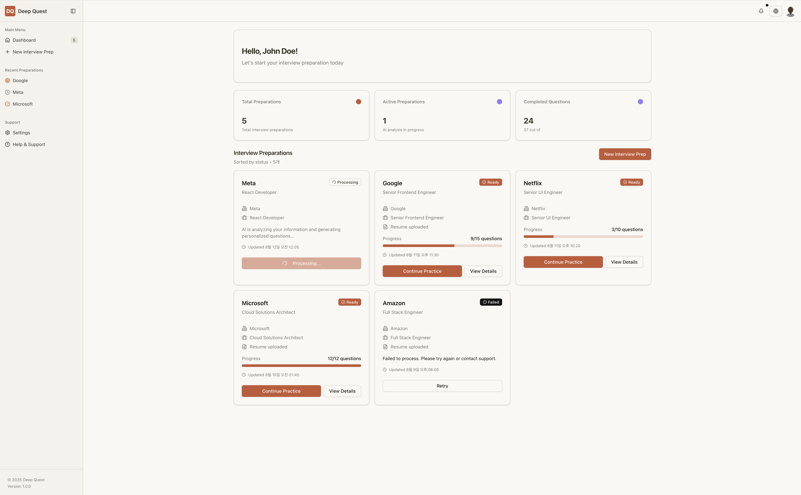
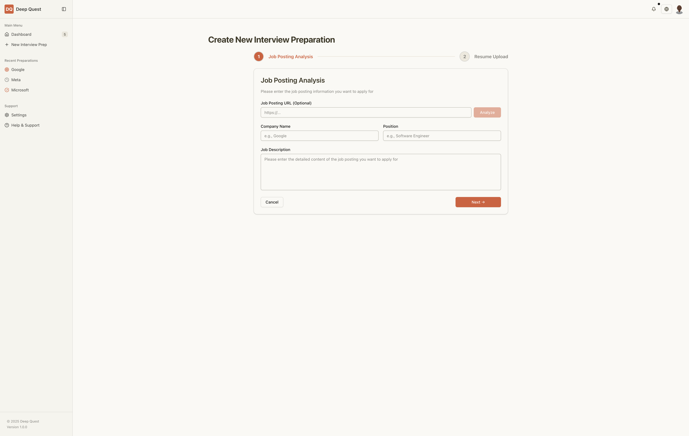
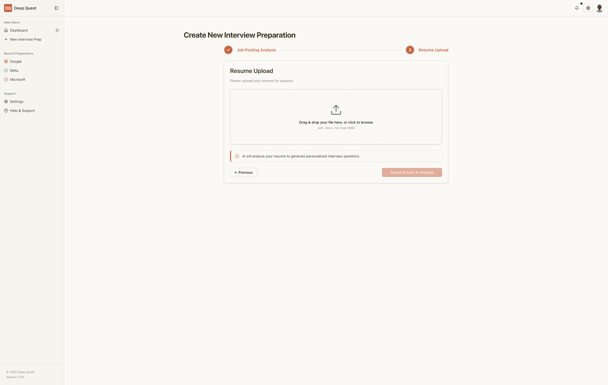
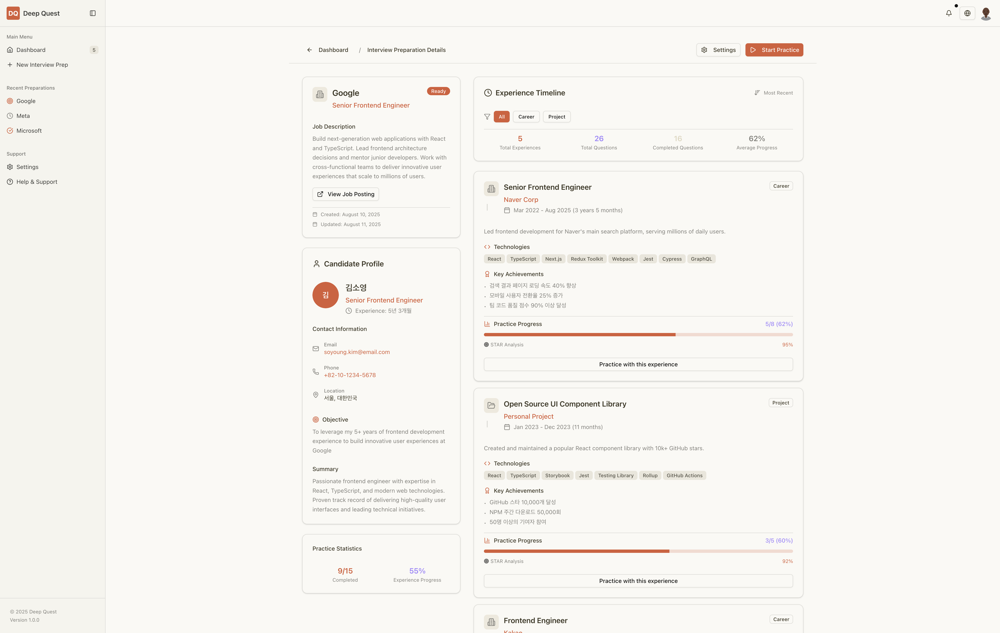
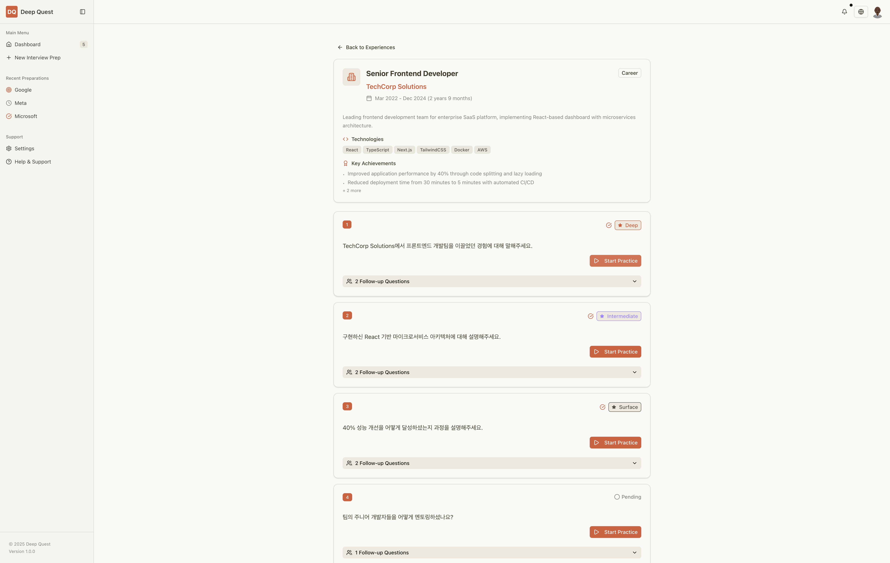
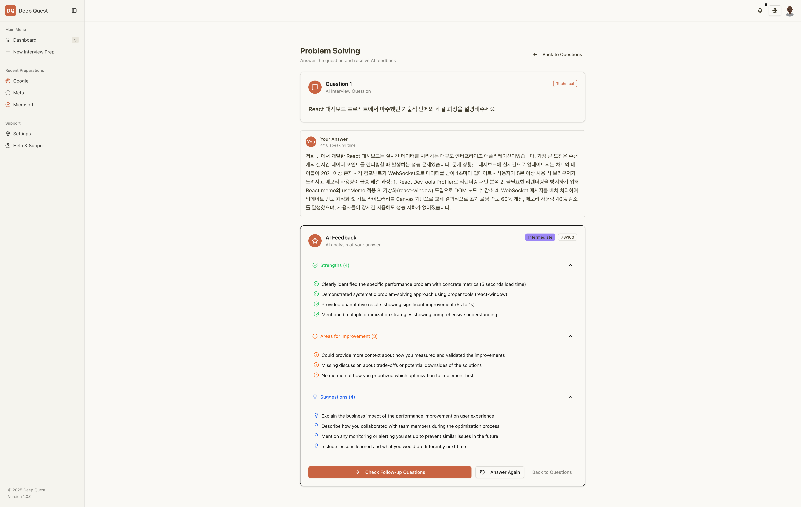
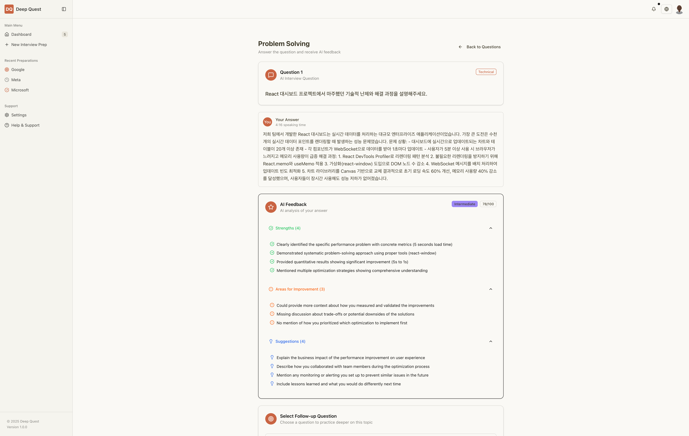
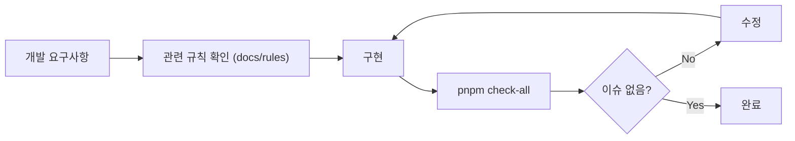

# Deep Quest - AI Interview Coaching Service

AI 기반 기술 면접 코칭 서비스의 Next.js 프론트엔드 애플리케이션입니다.

## 📋 Overview

Deep Quest는 개발자의 이력서와 목표 직무를 분석하여 맞춤형 기술 면접 질문을 생성하고, AI 피드백을 통해 면접 준비를 돕는 서비스입니다.

### 주요 기능

- 📄 이력서 기반 맞춤형 질문 생성
- 🎯 직무별 특화 면접 준비
- 💬 AI 피드백 및 후속 질문
- 🌏 한국어/영어 다국어 지원
- 📊 면접 준비 진행 상황 대시보드

## 🛠 Tech Stack

- **Framework**: Next.js 15.4.5 (App Router)
- **Language**: TypeScript 5
- **Styling**: Tailwind CSS v4 + shadcn/ui
- **API**: tRPC v11.4.4
- **Database**: PostgreSQL (Supabase) + Prisma ORM v6.13.0
- **Authentication**: Clerk
- **State Management**: Zustand v5.0.7
- **Internationalization**: next-intl

## 📁 Project Structure

```
src/
├── app/                  # Next.js App Router
│   ├── [locale]/        # Internationalized routes
│   │   ├── (protected)/ # Auth-required pages
│   │   └── (public)/    # Public pages
│   └── api/             # API routes (tRPC, webhooks)
├── components/
│   ├── ui/              # shadcn/ui components
│   └── design-system/   # Design tokens
├── server/
│   └── api/             # tRPC routers and procedures
├── lib/                 # Utilities and helpers
├── hooks/               # Custom React hooks
└── generated/
    └── prisma/          # Generated Prisma Client
```

## 🚀 Getting Started

### Prerequisites

- Node.js 18+
- pnpm 9+
- PostgreSQL database (Supabase)

### Installation

```bash
# Install dependencies (MUST use pnpm)
pnpm install
```

### Development Commands

```bash
# Start development server
pnpm dev

# Build for production
pnpm build

# Start production server
pnpm start

# Code quality checks
pnpm check-all         # Run all checks
pnpm type-check        # TypeScript checking
pnpm lint              # ESLint
pnpm format            # Format with Prettier

# Database management
pnpm db:generate   # Generate Prisma Client
pnpm db:migrate    # Run migrations
pnpm db:studio     # Open Prisma Studio
```

### Environment Setup

환경 변수 설정이 필요합니다. 프로젝트 실행을 위한 환경 변수는 관리자에게 문의해 주세요.

Required environment variables:

- `DATABASE_URL`
- `NEXT_PUBLIC_CLERK_PUBLISHABLE_KEY`
- `CLERK_SECRET_KEY`
- `NEXT_PUBLIC_SUPABASE_URL`
- `NEXT_PUBLIC_SUPABASE_ANON_KEY`

## 📸 Screenshots

<details>
<summary>주요 화면 미리보기</summary>

### Dashboard

사용자의 면접 준비 현황을 한눈에 볼 수 있는 대시보드



### Interview Preparation Flow

#### Step 1: 채용 공고 분석

회사명, 직무, JD 입력



#### Step 2: 이력서 업로드

PDF/DOCX 파일 지원



### Interview Preparation Detail

면접 준비 상세 페이지 - 직무 설명, 후보자 프로필, 연습 통계



### Practice Session

#### Career Experience Questions

경력별 맞춤 질문 리스트 (Deep/Intermediate/Surface 카테고리)



#### Answer & AI Feedback

답변 작성 및 AI 피드백 (점수, 강점, 개선점, 제안사항)



#### Follow-up Questions

사용자 답변 기반 AI 생성 후속 질문



</details>

## 🔧 Development Guidelines

### Code Quality Standards

- **TypeScript**: Strict mode enabled
- **Components**: Server Components 우선, 필요시에만 Client Components 사용
- **Styling**: Design tokens 사용 필수 (`@/components/design-system/core.ts`)
- **State**: Zustand (client), React Query via tRPC (server)

### Pre-commit Checklist

- ✅ `pnpm check-all` 통과
- ✅ 모든 테스트 통과
- ✅ Design system 준수
- ✅ TypeScript strict mode 준수

## 📚 Documentation

프로젝트의 상세 문서는 다음 위치에서 확인할 수 있습니다:

- **Product Requirements**: `docs/project/prd/`
- **Architecture**: `docs/project/architecture/`
- **Development Rules**: `docs/rules/`
- **UI Screenshots**: `docs/pages/`

## 📐 Development Rules & Guidelines

프로젝트의 일관성과 품질을 보장하기 위한 체계적인 개발 규칙이 정의되어 있습니다.

### 규칙 구조 (관심사 분리)

#### 🎨 View Development (`docs/rules/view/`)

- **컴포넌트 아키텍처**: React 컴포넌트 설계 원칙 (SRP, SoC, Composition)
- **디자인 시스템**: 토큰 기반 일관된 스타일링
- **패턴 & 성능**: React 패턴과 Next.js 최적화
- **shadcn/ui 통합**: 컴포넌트 확장 패턴

#### 🔧 Backend Development (`docs/rules/backend/`)

- **API 설계**: tRPC 기반 타입 안전한 API
- **데이터베이스**: Supabase SSR 통합
- **데이터 페칭**: 서버/클라이언트 전략

#### 🔗 Common Development (`docs/rules/common/`)

- **TypeScript**: 하이브리드 타입 전략, strict mode
- **코드 품질**: 필수 `pnpm check-all` 실행
- **상태 관리**: Zustand, React Query, Context 전략

### 적용 프로세스

새로운 기능 개발 시:

1. 관련 규칙 문서 확인 (`docs/rules/`)
2. 규칙에 따라 구현
3. `pnpm check-all` 실행 (필수)
4. AI 에이전트로 코드 리뷰

## 🔄 Development Workflow

이 프로젝트는 규칙 문서와 품질 게이트를 중심으로 개발합니다.



1. 구현 전에 관련 규칙 문서를 먼저 확인합니다.
2. 기능 구현 후 `pnpm check-all`로 기본 품질 게이트를 통과시킵니다.
3. 필요하면 추가 리뷰나 수동 점검으로 마무리합니다.

## 🌐 Internationalization

한국어와 영어를 지원합니다. 번역 파일은 `locales/` 디렉토리에 위치합니다.

```
locales/
├── ko/    # Korean translations
└── en/    # English translations
```

## 📄 Status

현재 개발 중 (Development Phase)

---

For more information or access to environment variables, please contact the project administrator.
