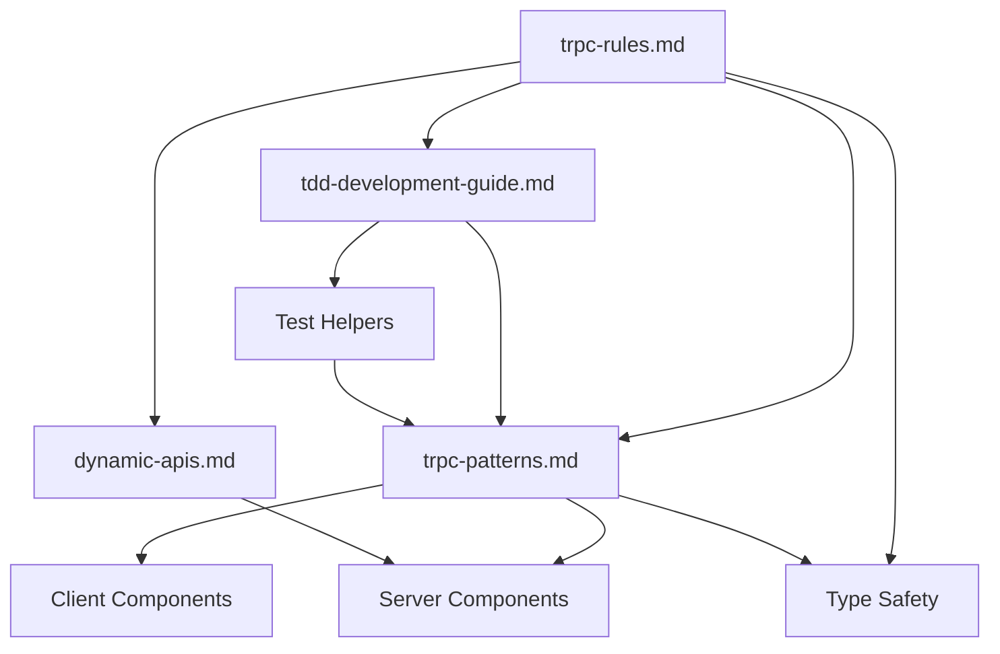

# API Development Rules

## Overview

이 디렉토리는 **tRPC v11 기반 API 개발**을 위한 핵심 규칙과 패턴을 정의합니다. 타입 안전한 API 설계, 보안, 에러 처리를 위한 포괄적인 가이드라인을 제공합니다.

## 📁 문서 구조

### 🔐 핵심 규칙 (Core Rules)

- **[trpc-rules.md](./trpc-rules.md)** - tRPC API 핵심 규칙과 컨벤션
  - 라우터 및 프로시저 구조
  - 입력/출력 검증 표준
  - 에러 처리 방식
  - 미들웨어와 컨텍스트
  - 금지되는 안티패턴

### 🎨 구현 패턴 (Implementation Patterns)

- **[trpc-patterns.md](./trpc-patterns.md)** - tRPC 활용 패턴 및 레시피
  - React Query 통합 패턴
  - 낙관적 업데이트 구현
  - 무한 스크롤 처리
  - Next.js App Router 통합
  - 배치 처리 및 Rate Limiting

### 🧪 테스트 주도 개발 (Test-Driven Development)

- **[tdd-development-guide.md](./tdd-development-guide.md)** - TDD API 개발 가이드
  - Red-Green-Refactor 사이클
  - 테스트 격리 및 자동 정리
  - 필수 테스트 케이스 체크리스트
  - 테스트 헬퍼 활용법
  - 병렬 테스트 실행 전략

### 🚀 Next.js 통합

- **[dynamic-apis.md](./dynamic-apis.md)** - Next.js 15+ 동적 API
  - Promise 기반 params/searchParams 처리
  - 비동기 컴포넌트 패턴

### 🤖 AI 통합

- **[langgraph-integration.md](./langgraph-integration.md)** - LangGraph SDK 통합 가이드
  - Next.js + tRPC 환경에서의 LangGraph SDK 활용
  - 스트리밍 처리 및 상태 관리
  - 에러 처리 및 보안 패턴
  - 테스트 전략 및 성능 최적화

## 🎯 적용 범위

### ✅ 적용 대상

- tRPC 프로시저 설계 및 구현
- API 입력/출력 검증 (Zod)
- 인증/인가 미들웨어 구현
- 에러 처리 및 로깅
- 클라이언트 사이드 훅 사용
- 서버 액션과 tRPC 통합
- React Query 캐싱 전략

### ❌ 적용 대상 아님

- UI 컴포넌트 개발 → [/docs/web/rules/view/](/docs/web/rules/view/) 참조
- 데이터베이스 직접 액세스 → [/docs/web/rules/backend/database/](/docs/web/rules/backend/database/) 참조
- 상태 관리 → [/docs/web/rules/common/state-management-rules.md](/docs/web/rules/common/state-management-rules.md) 참조

## 📋 규칙 우선순위

충돌하는 규칙이 있을 경우 다음 순서로 적용:

1. **보안** - 인증/인가 및 데이터 보호가 최우선
2. **타입 안전성** - 엔드투엔드 타입 체크
3. **에러 처리** - 명확하고 일관된 에러 응답
4. **성능** - 효율적인 쿼리와 캐싱

## 🔄 문서 간 관계



- **trpc-rules.md**: 모든 API 개발의 기초 규칙
- **trpc-patterns.md**: 규칙을 기반으로 한 실제 구현 패턴
- **tdd-development-guide.md**: 테스트 우선 개발 프로세스
- **dynamic-apis.md**: Next.js 15+ 특화 기능

## 🚀 빠른 시작 가이드

### 1. TDD로 새로운 API 엔드포인트 생성

```typescript
// 1. tdd-development-guide.md 참조하여 테스트 먼저 작성
// 2. Red-Green-Refactor 사이클 따르기
// 3. trpc-rules.md 참조하여 구현

// 테스트 먼저 작성 (RED)
it('should create post', async () => {
  const result = await router.createCaller(ctx).create({...})
  expect(result).toMatchObject({...})
})

// 구현 (GREEN)
export const postRouter = router({
  create: protectedProcedure
    .input(CreatePostInput)
    .mutation(async ({ input, ctx }) => {
      // 구현
    }),
})
```

### 2. 클라이언트에서 사용

```typescript
// trpc-patterns.md 참조하여 React Query 패턴 적용
const { mutate } = api.post.create.useMutation({
  onSuccess: () => {
    // 성공 처리
  },
})
```

## 🛡️ 보안 체크리스트

- [ ] 모든 mutation은 `protectedProcedure` 사용
- [ ] 포괄적인 Zod 스키마 검증
- [ ] TRPCError로 일관된 에러 처리
- [ ] 민감한 데이터 필터링 (.output() 사용)
- [ ] Rate limiting 적용 (필요시)

## 📊 성능 고려사항

- **낙관적 업데이트**: UX 향상을 위한 즉각적 UI 반영
- **무한 스크롤**: cursor 기반 페이지네이션
- **캐싱 전략**: staleTime, refetchInterval 적절히 설정
- **배치 처리**: 트랜잭션으로 여러 작업 묶기

## ⚠️ 자주 발생하는 실수

1. **약한 입력 검증** → 포괄적인 Zod 스키마 사용
2. **일반 Error 사용** → TRPCError 사용
3. **publicProcedure 남용** → 적절한 인증 확인
4. **민감 데이터 노출** → .output() 스키마로 필터링
5. **비효율적 쿼리** → 페이지네이션 적용

## 🔧 디버깅 팁

- tRPC 링크에서 로깅 활성화
- React Query DevTools 활용
- 네트워크 탭에서 요청/응답 확인
- TypeScript 에러 메시지 주의 깊게 읽기
