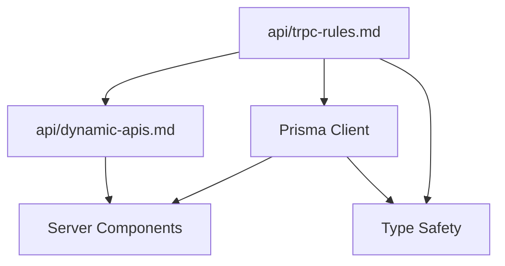

# Backend Development Rules

## Overview

이 디렉토리는 **Next.js 백엔드 개발**과 관련된 모든 규칙을 포함합니다. API 설계, 데이터베이스 연동, 서버 사이드 로직 구현에 필요한 가이드라인을 제공합니다.

## 📁 디렉토리 구조

### 🔌 api/

API 개발과 통신 관련 규칙들

- **[@docs/web/rules/backend/api/index.md](@docs/web/rules/backend/api/index.md)** - API 개발 규칙 종합 가이드
- **[@docs/web/rules/backend/api/trpc-rules.md](@docs/web/rules/backend/api/trpc-rules.md)** - tRPC API 핵심 규칙과 컨벤션
- **[@docs/web/rules/backend/api/trpc-patterns.md](@docs/web/rules/backend/api/trpc-patterns.md)** - tRPC 활용 패턴 및 실제 구현 레시피
- **[@docs/web/rules/backend/api/dynamic-apis.md](@docs/web/rules/backend/api/dynamic-apis.md)** - Next.js 15+ 동적 API, Promise 기반 params/searchParams

### 🗄️ database/

> **참고**: 현재 프로젝트는 Prisma를 통해 Supabase PostgreSQL에 접근합니다.

데이터베이스 연동 관련 참고사항:

- **Prisma 싱글톤**: `/src/lib/db/prisma.ts`에서 관리
- **Prisma 타입**: `@/generated/prisma/client`, `@/generated/prisma/enums`에서 import
- **Import 패턴**: [trpc-rules.md](./api/trpc-rules.md)의 Prisma v7 Import 패턴 섹션 참조

### 📊 data-fetching/

데이터 페칭 전략과 패턴

- **[@docs/web/rules/backend/data-fetching-rules.md](@docs/web/rules/backend/data-fetching-rules.md)** - Next.js 15 서버/클라이언트 데이터 페칭 전략

## 🎯 적용 범위

이 규칙들은 다음 작업에 적용됩니다:

### ✅ 적용 대상

- tRPC API 엔드포인트 개발
- Zod 스키마 정의 및 유효성 검사
- Supabase 데이터베이스 연동
- 서버 컴포넌트에서 데이터 페칭
- Route Handlers 구현
- 서버 액션 (Server Actions) 개발
- 미들웨어 구현
- 인증 및 권한 관리

### ❌ 적용 대상 아님

- React 컴포넌트 개발 → [@docs/web/rules/view/](@docs/web/rules/view/) 참조
- 디자인 시스템 적용 → [@docs/web/rules/view/](@docs/web/rules/view/) 참조
- TypeScript 타입 정의 → [@docs/web/rules/common/](@docs/web/rules/common/) 참조
- 공통 설계 원칙 → [@docs/web/rules/common/](@docs/web/rules/common/) 참조

## 📋 규칙 우선순위

충돌하는 규칙이 있을 경우 다음 순서로 적용:

1. **보안** - 데이터 보호와 인증이 최우선
2. **타입 안전성** - tRPC와 Zod를 통한 런타임 검증
3. **성능** - 효율적인 데이터 페칭과 캐싱
4. **에러 처리** - 명확한 에러 메시지와 복구 전략

## 🔄 규칙 간 연관관계



- **tRPC 규칙**이 모든 API 개발의 기초
- **Prisma Client**가 서버 컴포넌트 데이터 페칭 방식 결정
- **동적 API**가 Next.js 15+ 비동기 패턴 적용
- 모든 규칙이 **타입 안전성** 확보에 기여

## 🚀 빠른 시작 가이드

새로운 백엔드 기능 개발 시:

1. **[api/trpc-rules.md](./api/trpc-rules.md)** - tRPC 핵심 규칙과 컨벤션 확인
2. **[api/trpc-patterns.md](./api/trpc-patterns.md)** - 실제 구현 패턴과 레시피 참고
3. **[data-fetching-rules.md](./data-fetching-rules.md)** - 서버/클라이언트 데이터 페칭 전략
4. **Prisma Client**: `/src/lib/db/prisma.ts` 싱글톤 사용
5. **[api/dynamic-apis.md](./api/dynamic-apis.md)** - Next.js 15+ 비동기 API 패턴
6. 입력 검증 스키마 정의 (Zod)
7. 에러 처리 및 보안 검토

## 🛡️ 보안 체크리스트

모든 백엔드 코드는 다음을 준수해야 합니다:

- [ ] `protectedProcedure` 사용으로 인증 확인
- [ ] Zod 스키마로 모든 입력 검증
- [ ] SQL 인젝션 방지 (Prisma/Supabase 사용)
- [ ] 민감한 데이터 로깅 금지
- [ ] 적절한 CORS 설정
- [ ] Rate limiting 적용 (필요시)

## 📊 성능 고려사항

- **서버 컴포넌트 우선**: 가능한 한 서버에서 데이터 페칭
- **병렬 데이터 페칭**: 독립적인 쿼리는 병렬 실행
- **캐싱 전략**: React Query(tRPC)와 Next.js 캐싱 활용
- **스트리밍**: Suspense와 함께 점진적 로딩

## 🔧 데이터 페칭 패턴

### Server Components (권장)

```typescript
// ✅ 서버 컴포넌트에서 직접 데이터 페칭
async function UserProfile({ userId }: { userId: string }) {
  const user = await trpc.user.byId.query({ id: userId });
  return <div>{user.name}</div>;
}
```

### Client Components (필요시)

```typescript
// ✅ 클라이언트 컴포넌트에서 tRPC hooks 사용
function UserProfile({ userId }: { userId: string }) {
  const { data: user } = trpc.user.byId.useQuery({ id: userId });
  return <div>{user?.name}</div>;
}
```

## ⚠️ 자주 발생하는 실수

1. **publicProcedure 남용** → 적절한 인증 체크
2. **약한 입력 검증** → 포괄적인 Zod 스키마 사용
3. **에러 정보 노출** → 보안을 고려한 에러 메시지
4. **N+1 쿼리 문제** → 데이터 로더 패턴 적용
5. **클라이언트에서 과도한 데이터 페칭** → 서버 컴포넌트 활용
