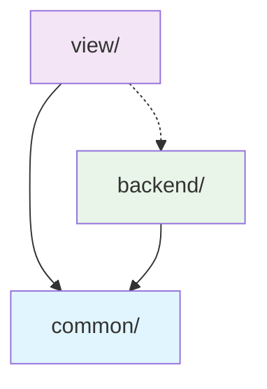

# Common Development Rules

## Overview

이 디렉토리는 **프론트엔드와 백엔드 전반**에 적용되는 공통 개발 규칙을 포함합니다. 모든 Next.js 개발에서 준수해야 하는 기본 원칙과 타입 관리 가이드라인을 제공합니다.

## 📁 디렉토리 구조

### 🔧 typescript/

TypeScript 타입 관리와 코드 품질 규칙들

- **[@docs/web/rules/common/typescript/typing.md](@docs/web/rules/common/typescript/typing.md)** - 타입 정의 패턴, 하이브리드 타입 관리, 네이밍 규칙

### 🎯 code-quality/

코드 품질 관리와 검증 규칙들

- **[@docs/web/rules/common/code-quality.md](@docs/web/rules/common/code-quality.md)** - 필수 코드 검증 프로세스, 작업 완료 후 check-all 실행 규칙

### 🔄 state-management/

상태 관리 전략과 규칙들

- **[@docs/web/rules/common/state-management-rules.md](@docs/web/rules/common/state-management-rules.md)** - Next.js 15 상태 관리 전략 (Zustand, React Query, Context)

## 🎯 적용 범위

이 규칙들은 **모든 개발 영역**에 적용됩니다:

### ✅ 적용 대상

- TypeScript 타입 정의 및 관리
- **코드 품질 검증 프로세스** (필수)
- **상태 관리 전략** (Zustand, React Query, Context)
- 코드 구조 설계 원칙
- 모듈 간 의존성 관리
- 파일 및 디렉토리 구조
- 네이밍 컨벤션
- 재사용 가능한 유틸리티 함수
- 공통 상수 및 설정

### 🔄 규칙 적용 우선순위

1. **코드 품질 검증** - 모든 작업 완료 후 `pnpm run check-all` 실행 (필수)
2. **타입 안전성** - 모든 코드에서 타입 체크 통과
3. **상태 관리 일관성** - 적절한 상태 관리 도구 선택 및 적용
4. **결합도 최소화** - 모듈 간 독립성 확보
5. **일관성** - 프로젝트 전반의 코딩 스타일 통일
6. **가독성** - 명확하고 이해하기 쉬운 코드

## 🔄 다른 카테고리와의 관계

### Frontend ([@docs/web/rules/view/](@docs/web/rules/view/))에서 활용

```typescript
// common/ 타입 규칙을 view/ 컴포넌트에서 활용
import { UserProfile } from '@/types/user' // 중앙 관리 타입

interface UserCardProps {
  user: UserProfile // 재사용 가능한 타입
}
```

### Backend ([@docs/web/rules/backend/](@docs/web/rules/backend/))에서 활용

```typescript
// common/ 타입 규칙을 backend/ API에서 활용
import { CreateUserInput } from '@/types/user'; // 공유 타입

export const userRouter = router({
  create: protectedProcedure
    .input(CreateUserInput) // 일관된 타입 사용
    .mutation(async ({ input }) => { ... })
});
```

## 📋 타입 관리 전략

### 하이브리드 패턴 적용

- **지역 타입**: 특정 컴포넌트/기능에만 사용되는 타입
- **중앙 타입**: 프로젝트 전반에서 재사용되는 핵심 타입

```
types/
├── api.ts      # API 관련 공통 타입
├── user.ts     # User 도메인 타입
└── common.ts   # 범용 유틸리티 타입
```

### 타입 재사용 패턴

```typescript
// ✅ 기본 타입에서 파생
export type CreateUserInput = Pick<User, 'name' | 'email'>
export type UpdateUserInput = Partial<CreateUserInput> & { id: string }
export type UserResponse = Omit<User, 'password'>
```

## 🏗️ 결합도 관리 전략

### 의존성 방향 규칙



- **common/** ← 모든 모듈에서 참조 가능
- **view/** ↔ **backend/** 간접적 통신 (tRPC 등)
- 순환 의존성 금지

### 모듈 독립성 체크리스트

- [ ] 각 모듈이 독립적으로 테스트 가능
- [ ] 인터페이스를 통한 느슨한 결합
- [ ] 공통 의존성은 common/에서 관리
- [ ] 순환 참조 없음

## 🚀 빠른 시작 가이드

새로운 기능 개발 시:

1. **타입 설계** - [@docs/web/rules/common/typescript/typing.md](@docs/web/rules/common/typescript/typing.md)에서 타입 관리 패턴 확인
2. **상태 관리 전략** - [@docs/web/rules/common/state-management-rules.md](@docs/web/rules/common/state-management-rules.md)에서 적절한 도구 선택
3. **공통 타입 확인** - `types/` 디렉토리에서 재사용 가능한 타입 검토
4. **네이밍 규칙** - 일관된 명명 규칙 적용
5. **⚠️ 작업 완료 후** - [@docs/web/rules/common/code-quality.md](@docs/web/rules/common/code-quality.md)에 따라 `pnpm run check-all` 실행

## 🔍 코드 품질 기준

### TypeScript 엄격성

```typescript
// tsconfig.json에서 엄격한 설정 필수
{
  "compilerOptions": {
    "strict": true,
    "noImplicitAny": true,
    "strictNullChecks": true,
    "noImplicitReturns": true
  }
}
```

### 타입 정의 품질

- **명시적 타입 선언** - `any` 사용 금지
- **적절한 제네릭 활용** - 재사용성 증대
- **타입 가드 활용** - 런타임 안전성 확보
- **유니온 타입 적절한 사용** - 정확한 타입 표현

## ⚠️ 자주 발생하는 실수

1. **any 타입 남용** → 명시적 타입 정의
2. **순환 의존성** → 의존성 방향 재설계
3. **중복 타입 정의** → 중앙 타입 재사용
4. **과도한 결합** → 인터페이스 분리
5. **타입 정의 누락** → 엄격한 타입 체크 활용

## 🛠️ 도구 및 설정

### 필수 도구

- **TypeScript** - 타입 안전성
- **ESLint** - 코드 품질 검사
- **Prettier** - 코드 포맷팅
- **Husky** - 커밋 전 검증

### 권장 VSCode 확장

- TypeScript Importer
- Auto Import - ES6, TS, JSX, TSX
- Path Intellisense
- TypeScript Error Translator
