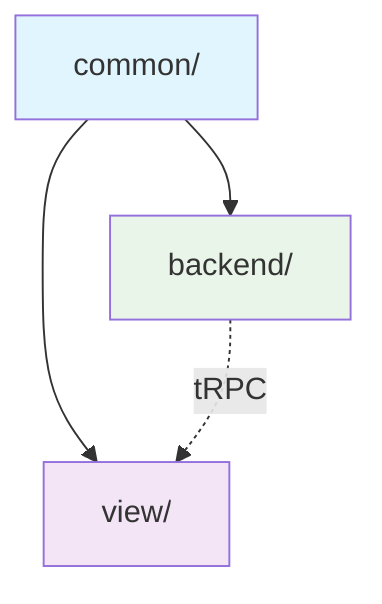

# Frontend Development Rules & Guidelines

이 문서는 프론트엔드 개발에서 적용할 수 있는 모든 규칙과 가이드라인을 체계적으로 정리합니다.

## 📁 규칙 구조 개요

규칙들은 **관심사 분리**에 따라 세 가지 카테고리로 구성되어 있습니다:

### 🎨 [@docs/web/rules/view/](@docs/web/rules/view/) - Frontend View Development

프론트엔드 사용자 인터페이스 개발에 관한 모든 규칙

- **컴포넌트 아키텍처** - React 컴포넌트 설계 원칙
- **디자인 시스템** - 토큰 기반 일관된 스타일링
- **패턴 & 성능** - React 패턴과 Next.js 최적화
- **설계 원칙** - 가독성, 예측 가능성, 응집성

### 🔧 [@docs/web/rules/backend/](@docs/web/rules/backend/) - Backend Development

백엔드 API와 데이터 계층 개발에 관한 모든 규칙

- **API 설계** - tRPC 기반 타입 안전한 API
- **데이터베이스** - Supabase SSR 통합
- **보안 & 인증** - 안전한 데이터 접근

### 🔗 [@docs/web/rules/common/](@docs/web/rules/common/) - Common Development

프론트엔드와 백엔드 전반에 적용되는 공통 규칙

- **TypeScript 타입 관리** - 하이브리드 타입 전략
- **코드 품질 검증** - 필수 check-all 실행 규칙
- **설계 원칙** - 결합도 최소화, 모듈 독립성

## 🎯 적용 범위 가이드

### 새로운 컴포넌트 개발

```bash
1. view/components/design-principles.md → React 컴포넌트 설계 원칙 확인
2. view/components/ → 컴포넌트 아키텍처와 패턴 적용
3. view/design/ → 디자인 토큰 사용
4. common/typescript/ → 타입 정의
5. ⚠️ 작업 완료 후 → pnpm run check-all 실행 (필수)
```

### API 엔드포인트 개발

```bash
1. backend/api/ → tRPC 패턴 적용
2. backend/database/ → 데이터 연동
3. common/typescript/ → 타입 정의
4. ⚠️ 작업 완료 후 → pnpm run check-all 실행 (필수)
```

### 전체 기능 개발

```bash
1. common/ → 공통 설계 원칙과 타입 전략
2. backend/ → API와 데이터 계층 구현
3. view/ → 사용자 인터페이스 구현
4. ⚠️ 각 단위 완료 후 → pnpm run check-all 실행 (필수)
```

## 🔄 규칙 간 의존성



- **common/** - 모든 개발의 기초가 되는 공통 규칙
- **view/** & **backend/** - common 규칙을 확장한 전문 규칙
- **상호 통신** - tRPC를 통한 타입 안전한 연동

## 📋 핵심 개발 원칙

### 1. 타입 안전성 우선

- TypeScript strict mode 필수
- any 타입 사용 금지
- 런타임 검증 (Zod) 활용

### 2. 관심사 분리

- UI 로직 vs 비즈니스 로직 분리
- 클라이언트 vs 서버 경계 명확화
- 컴포넌트 단일 책임 원칙

### 3. 성능 최적화

- 서버 컴포넌트 우선 사용
- 적절한 메모이제이션 적용
- 번들 크기 최소화

### 4. 일관성 유지

- 디자인 토큰 기반 스타일링
- shadcn/ui 컴포넌트 우선 사용
- 통일된 코딩 컨벤션

## 🚀 빠른 시작 가이드

### 🔰 처음 시작하는 경우

1. **[@docs/web/rules/common/index.md](@docs/web/rules/common/index.md)** - 전체 프로젝트에 적용되는 기본 원칙
2. 개발 영역에 따라 [@docs/web/rules/view/](@docs/web/rules/view/) 또는 [@docs/web/rules/backend/](@docs/web/rules/backend/) 가이드 확인

### 🎨 UI 컴포넌트 개발

1. **[@docs/web/rules/view/components/design-principles.md](@docs/web/rules/view/components/design-principles.md)** - React 컴포넌트 설계 원칙 학습
2. **[@docs/web/rules/view/components/architecture.md](@docs/web/rules/view/components/architecture.md)** - 컴포넌트 구조 설계
3. **[@docs/web/rules/view/components/composition-patterns.md](@docs/web/rules/view/components/composition-patterns.md)** - Props 드릴링 해결 및 컴포지션 패턴
4. **[@docs/web/rules/view/design/system.md](@docs/web/rules/view/design/system.md)** - 디자인 토큰 적용

### 🔧 API 개발

1. **[@docs/web/rules/backend/api/trpc.md](@docs/web/rules/backend/api/trpc.md)** - tRPC API 설계
2. **[@docs/web/rules/backend/database/supabase-ssr.md](@docs/web/rules/backend/database/supabase-ssr.md)** - 데이터 연동
3. **[@docs/web/rules/common/typescript/typing.md](@docs/web/rules/common/typescript/typing.md)** - 타입 정의

## ⚠️ 자주 발생하는 실수들

| 실수                       | 해결책                  | 참고 문서                                                                                                    |
| -------------------------- | ----------------------- | ------------------------------------------------------------------------------------------------------------ |
| Raw HTML 사용              | shadcn/ui 컴포넌트 사용 | [@docs/web/rules/view/components/shadcn-ui.md](@docs/web/rules/view/components/shadcn-ui.md)                 |
| 하드코딩된 색상            | 디자인 토큰 사용        | [@docs/web/rules/view/design/system.md](@docs/web/rules/view/design/system.md)                               |
| any 타입 남용              | 명시적 타입 정의        | [@docs/web/rules/common/typescript/typing.md](@docs/web/rules/common/typescript/typing.md)                   |
| 과도한 클라이언트 컴포넌트 | 서버 컴포넌트 우선      | [@docs/web/rules/view/patterns/performance.md](@docs/web/rules/view/patterns/performance.md)                 |
| 약한 API 검증              | Zod 스키마 사용         | [@docs/web/rules/backend/api/trpc.md](@docs/web/rules/backend/api/trpc.md)                                   |
| 복잡한 컴포넌트            | 컴포넌트 설계 원칙 적용 | [@docs/web/rules/view/components/design-principles.md](@docs/web/rules/view/components/design-principles.md) |
| 일관성 없는 API 응답       | 표준 응답 패턴 사용     | [@docs/web/rules/backend/api/patterns.md](@docs/web/rules/backend/api/patterns.md)                           |
| check-all 실행 누락        | 작업 완료 후 품질 검증  | [@docs/web/rules/common/code-quality.md](@docs/web/rules/common/code-quality.md)                             |

## 🛠️ 품질 보증 체크리스트

### 코드 작성 전

- [ ] 기존 컴포넌트/유틸리티 재사용 가능성 확인
- [ ] 적절한 카테고리 규칙 검토
- [ ] 타입 설계 계획

### 구현 중

- [ ] 해당 카테고리 규칙 준수
- [ ] TypeScript 엄격성 유지
- [ ] 적절한 에러 처리

### 구현 후

- [ ] **🚨 `cd /Users/smartcow/Desktop/dev/deep-quest/web && pnpm run check-all` 실행 (필수)**
- [ ] 타입 검사 통과
- [ ] 린터 규칙 통과
- [ ] 성능 영향도 확인
- [ ] 관련 문서 업데이트

---

## 📖 상세 가이드

각 카테고리의 상세한 규칙과 예제는 해당 디렉토리의 index.md 파일을 참조하세요:

- 📁 **[@docs/web/rules/view/index.md](@docs/web/rules/view/index.md)** - 프론트엔드 UI 개발 규칙 전체 가이드
- 📁 **[@docs/web/rules/backend/index.md](@docs/web/rules/backend/index.md)** - 백엔드 API & 데이터 개발 규칙 전체 가이드
- 📁 **[@docs/web/rules/common/index.md](@docs/web/rules/common/index.md)** - 공통 개발 규칙 전체 가이드

_이 가이드라인은 팀의 개발 경험과 모범 사례를 바탕으로 지속적으로 업데이트됩니다._
