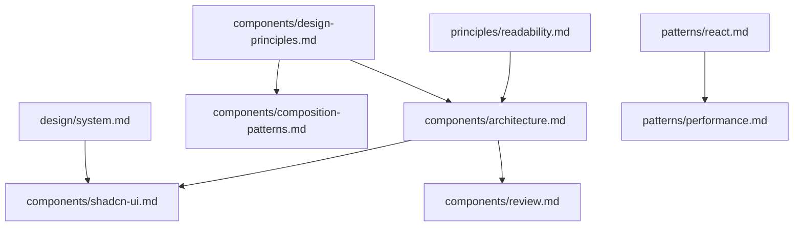

# Frontend View Development Rules

## Overview

이 디렉토리는 **Next.js 프론트엔드 개발**과 관련된 모든 규칙을 포함합니다. 사용자 인터페이스 구현, 컴포넌트 설계, 디자인 시스템 적용에 필요한 가이드라인을 제공합니다.

## 📁 디렉토리 구조

### 🎨 components/

컴포넌트 설계와 구현 관련 규칙들

- **[@docs/web/rules/view/components/architecture.md](@docs/web/rules/view/components/architecture.md)** - 컴포넌트 아키텍처 원칙, 단일 책임, 컴포지션 패턴
- **[@docs/web/rules/view/components/design-principles.md](@docs/web/rules/view/components/design-principles.md)** - React 컴포넌트 설계 원칙 (SRP, SoC, Composition over Inheritance)
- **[@docs/web/rules/view/components/composition-patterns.md](@docs/web/rules/view/components/composition-patterns.md)** - Props 드릴링 해결과 서버/클라이언트 분리 패턴
- **[@docs/web/rules/view/components/shadcn-ui.md](@docs/web/rules/view/components/shadcn-ui.md)** - shadcn/ui 컴포넌트 사용법과 확장 패턴
- **[@docs/web/rules/view/components/review.md](@docs/web/rules/view/components/review.md)** - 컴포넌트 리뷰 가이드라인

### 🎯 design/

디자인 시스템과 스타일 관련 규칙들

- **[@docs/web/rules/view/design/system.md](@docs/web/rules/view/design/system.md)** - 디자인 토큰 사용법, 색상, 간격, 타이포그래피

### 🔄 patterns/

React 패턴과 Next.js 구현 패턴들

- **[@docs/web/rules/view/patterns/react.md](@docs/web/rules/view/patterns/react.md)** - React 컴포넌트 패턴, hooks 사용법, 상태 관리
- **[@docs/web/rules/view/patterns/performance.md](@docs/web/rules/view/patterns/performance.md)** - Next.js 성능 최적화, 서버/클라이언트 분리
- **[@docs/web/rules/view/patterns/project-structure.md](@docs/web/rules/view/patterns/project-structure.md)** - App Router 기반 프로젝트 구조 패턴
- **[@docs/web/rules/view/patterns/forms.md](@docs/web/rules/view/patterns/forms.md)** - 폼 처리, 서버 액션, 유효성 검사 패턴

### 📖 principles/

일반적인 프론트엔드 개발 설계 원칙들

- **[@docs/web/rules/view/principles/readability.md](@docs/web/rules/view/principles/readability.md)** - 코드 가독성 향상 원칙
- **[@docs/web/rules/view/principles/i18n.md](@docs/web/rules/view/principles/i18n.md)** - 국제화(i18n) 및 next-intl 사용 규칙

## 🎯 적용 범위

이 규칙들은 다음 작업에 적용됩니다:

### ✅ 적용 대상

- React 컴포넌트 개발
- Next.js 페이지 및 레이아웃 구현
- shadcn/ui 컴포넌트 사용 및 확장
- 디자인 시스템 토큰 적용
- 클라이언트 사이드 상태 관리
- UI/UX 인터랙션 구현
- 성능 최적화 (렌더링, 번들 크기)
- 국제화(i18n) 및 다국어 지원

### ❌ 적용 대상 아님

- tRPC API 개발 → [@docs/web/rules/backend/](@docs/web/rules/backend/) 참조
- 데이터베이스 연동 → [@docs/web/rules/backend/](@docs/web/rules/backend/) 참조
- TypeScript 타입 정의 → [@docs/web/rules/common/](@docs/web/rules/common/) 참조
- 공통 설계 원칙 → [@docs/web/rules/common/](@docs/web/rules/common/) 참조

## 📋 규칙 우선순위

충돌하는 규칙이 있을 경우 다음 순서로 적용:

1. **컴포넌트 아키텍처** - 기본 설계 원칙이 최우선
2. **디자인 시스템** - 일관된 UI/UX를 위한 토큰 사용
3. **성능 최적화** - 사용자 경험 향상
4. **코드 품질** - 가독성과 유지보수성

## 🔄 규칙 간 연관관계

- **가독성 원칙**과 **컴포넌트 설계 원칙**이 아키텍처의 기반
- **설계 원칙**이 컴포지션 패턴 사용을 안내
- **컴포넌트 아키텍처**가 shadcn/ui 사용법 결정
- **디자인 시스템**이 컴포넌트 스타일링 방향 제시
- **React 패턴**이 성능 최적화의 기초

## 🚨 MUST Reference Rules

**Next.js 컴포넌트 개발 시 반드시 준수해야 하는 필수 규칙들:**

### 📋 개발 전 필수 확인

- **[@docs/web/rules/view/components/design-principles.md](@docs/web/rules/view/components/design-principles.md)** - React 컴포넌트 설계 원칙 (SRP, SoC, Composition over Inheritance)
- **[@docs/web/rules/view/components/architecture.md](@docs/web/rules/view/components/architecture.md)** - 컴포넌트 아키텍처 원칙과 단일 책임
- **[@docs/web/rules/view/components/composition-patterns.md](@docs/web/rules/view/components/composition-patterns.md)** - Props 드릴링 해결과 서버/클라이언트 분리
- **[@docs/web/rules/view/components/shadcn-ui.md](@docs/web/rules/view/components/shadcn-ui.md)** - shadcn/ui 컴포넌트 우선 사용 규칙
- **[@docs/web/rules/view/components/review.md](@docs/web/rules/view/components/review.md)** - 컴포넌트 리뷰 가이드라인
- **[@docs/web/rules/view/patterns/project-structure.md](@docs/web/rules/view/patterns/project-structure.md)** - App Router 기반 프로젝트 구조 패턴
- **[@docs/web/rules/view/patterns/react.md](@docs/web/rules/view/patterns/react.md)** - React 컴포넌트 패턴과 hooks 사용법
- **[@docs/web/rules/view/principles/i18n.md](@docs/web/rules/view/principles/i18n.md)** - 국제화 규칙: next-intl 필수 사용

### ✅ 개발 후 필수 체크리스트

- [ ] 모든 components/ 규칙 준수 확인
- [ ] 프로젝트 구조 패턴 일치 확인
- [ ] React 패턴 올바른 적용 확인
- [ ] shadcn/ui 컴포넌트 우선 사용 확인
- [ ] 서버/클라이언트 컴포넌트 적절한 분리 확인
- [ ] Props 드릴링 최소화 확인
- [ ] 단일 책임 원칙 준수 확인
- [ ] 모든 텍스트 next-intl 사용 확인 (하드코딩된 텍스트 없음)

---

## 🚀 빠른 시작 가이드

새로운 프론트엔드 기능 개발 시:

1. **위의 MUST Reference Rules 모두 확인** - 필수 규칙들 숙지
2. **[@docs/web/rules/view/design/system.md](@docs/web/rules/view/design/system.md)** - 디자인 토큰 적용
3. **[@docs/web/rules/view/patterns/performance.md](@docs/web/rules/view/patterns/performance.md)** - 성능 최적화 적용

## ⚠️ 자주 발생하는 실수

1. **Raw HTML 사용** → shadcn/ui 컴포넌트 사용
2. **하드코딩된 색상** → 디자인 토큰 사용
3. **과도한 클라이언트 컴포넌트** → 서버 컴포넌트 우선
4. **복잡한 단일 컴포넌트** → 단일 책임 원칙 적용
5. **하드코딩된 텍스트** → next-intl 사용 (`locale === 'ko' ? '텍스트' : 'Text'` 금지)
